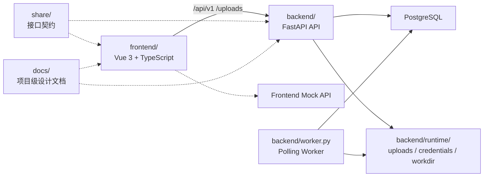

# Agent Security Platform

Agent Security Platform 是一个面向 Agent API 的安全测试平台仓库。当前仓库包含 Vue 3 前端控制台、FastAPI 后端服务、基于 PostgreSQL 轮询的 worker，以及前后端共享的接口契约文档。

## 项目简介

平台当前聚焦一条可联调的主链路：

- 展示数据集目录与详情
- 提交 Agent 评测任务
- 查看评测记录与详情
- 对任务执行暂停、恢复、终止、取消等动作
- 在前端真实 API 模式与 Mock 模式之间切换

当前仓库适合作为以下工作的统一入口：

- 前端页面与交互联调
- 后端接口与状态流转联调
- 提交链路与评测记录链路联调
- 跨端接口契约核对
- 项目级设计和拆解文档查阅

## 当前进度概览

| 子系统              | 当前状态                                                                                                                                           |
| ------------------- | -------------------------------------------------------------------------------------------------------------------------------------------------- |
| 前端 `frontend/`    | 已实现首页、数据集目录/详情、排行榜、联系页、登录注册、个人资料、提交评测页、评测记录页、评测详情页，以及真实 API / Mock API 双模式切换。          |
| 后端 API `backend/` | 已实现 `/api/v1/auth/*`、`/api/v1/user/*`、`/api/v1/datasets/*`、`/api/v1/agents/*`、`/api/v1/evaluations/*`，统一返回 `{ code, data, message }`。 |
| Worker              | 已具备 PostgreSQL 轮询领取任务、心跳续约、暂停/恢复/终止/取消状态处理，以及评测完成后的结果汇总链路。                                              |
| 数据与迁移          | 已具备 SQLAlchemy 模型、Alembic 迁移链路、运行时目录和上传目录收口。                                                                               |
| 接口契约 `share/`   | 保留统一 API 协议总表和用户、数据集/提交、评测三个补充说明文档，当前主要作为前后端沟通参考材料。                                                   |

## 已知边界

当前仓库已经具备前后端主链路联调能力，但以下能力仍处于持续增强阶段：

- 当前默认执行闭环以 `synthetic_local` runtime 为主，能够完成任务领取、样本执行、核心产物采集和报告摘要写回；更真实的 Agent 适配与调度模式仍在继续完善。
- 执行过程中的日志、页面访问、网络请求、工具调用等证据采集已具备基础链路，但产物种类与可观测性仍可继续扩充。
- 结构化 evaluator / oracle 能力仍在逐步补齐，当前不少样本仍依赖 `needs_review` 这类人工复核口径。
- 可下载报告、证据沉淀和更细粒度的统计展示仍需继续增强。
- worker 当前是 PostgreSQL 轮询版，启动/停止观测、健康检查与异常恢复策略仍有完善空间。

这些边界不会改变当前前端、后端和接口契约的阅读入口，但会影响真实执行深度与后续运维能力判断。

## 仓库结构

| 路径        | 职责                                                               |
| ----------- | ------------------------------------------------------------------ |
| `frontend/` | 前端工程，负责页面、状态管理、路由、共享 UI，以及前端 Mock API。   |
| `backend/`  | FastAPI 后端、数据库模型、业务模块、worker、迁移和后端测试。       |
| `share/`    | 前后端沟通参考材料目录；保留接口协议总表和补充说明，便于协作对齐。 |
| `docs/`     | 项目级设计说明、任务拆解、附录和参考性资料。                       |
| `README.md` | 项目级入口文档，不复制前后端内部实现细节。                         |

当前协作边界如下：

- 后端已实现接口、状态流转和验证命令：以 `backend/` 下文档、脚本和测试为准。
- `share/`：作为前后端沟通与评审参考，不作为后端实现真相源。
- 前端分层、页面职责、运行时链路：以 `frontend/docs/` 为主。
- 后端分层、领域规则、数据库与接口实现状态：以 `backend/docs/` 为主。
- 平台级设计背景、数据库附录与阶段任务拆解：以根目录 `docs/` 为主。

## 项目协作图



## 环境准备

| 工具       | 要求                         | 说明                                                                   |
| ---------- | ---------------------------- | ---------------------------------------------------------------------- |
| Node.js    | `>=24.14.1 <25`              | 前端 `package.json` 中已明确约束。                                     |
| pnpm       | 推荐 `10.33.2`               | 前端 `packageManager` 当前为 `pnpm@10.33.2`。                          |
| Python     | `>=3.12`，推荐 `3.12`        | 后端 `pyproject.toml` 要求 `>=3.12`，`.python-version` 当前为 `3.12`。 |
| uv         | 可执行 `uv sync` 和 `uv run` | 后端使用 uv 管理依赖、运行和迁移。                                     |
| PostgreSQL | 需要本地可用实例             | 仓库未锁定具体次版本，建议与团队开发环境保持一致。                     |

## 环境变量

### 前端

前端当前只使用以下三个环境变量：

| 变量                   | 推荐本地值              | 说明                                |
| ---------------------- | ----------------------- | ----------------------------------- |
| `VITE_API_BASE_URL`    | `/api/v1`               | 前端运行时 API 基地址。             |
| `VITE_BACKEND_TARGET`  | `http://127.0.0.1:8000` | 仅用于 Vite 开发代理目标。          |
| `VITE_ENABLE_API_MOCK` | `false`                 | `true` 时优先走前端 Mock 数据链路。 |

推荐本地联调配置：

```env
VITE_API_BASE_URL=/api/v1
VITE_BACKEND_TARGET=http://127.0.0.1:8000
VITE_ENABLE_API_MOCK=false
```

若需要跳过本地代理，直接访问后端：

```env
VITE_API_BASE_URL=http://127.0.0.1:8000/api/v1
VITE_ENABLE_API_MOCK=false
```

若只演示前端流程，不依赖真实后端：

```env
VITE_ENABLE_API_MOCK=true
```

### 后端

根目录不展开所有高级运行参数，只列最小必填项。其余配置定义在 [backend/app/shared/config.py](./backend/app/shared/config.py)。

| 变量                | 推荐本地值                | 说明               |
| ------------------- | ------------------------- | ------------------ |
| `PROJECT_NAME`      | `Agent Security Platform` | FastAPI 应用标题。 |
| `FASTAPI_HOST`      | `127.0.0.1`               | 本地开发监听地址。 |
| `FASTAPI_PORT`      | `8000`                    | 本地开发标准端口。 |
| `POSTGRES_HOST`     | `localhost`               | PostgreSQL 主机。  |
| `POSTGRES_PORT`     | `5432`                    | PostgreSQL 端口。  |
| `POSTGRES_DB`       | `<your_db_name>`          | 本地数据库名。     |
| `POSTGRES_USER`     | `postgres`                | 本地数据库用户名。 |
| `POSTGRES_PASSWORD` | `<your_db_password>`      | 本地数据库密码。   |
| `SQLALCHEMY_ECHO`   | `false`                   | 是否打印 SQL。     |

推荐本地 `.env` 示例：

```env
PROJECT_NAME="Agent Security Platform"
FASTAPI_HOST=127.0.0.1
FASTAPI_PORT=8000
POSTGRES_HOST=localhost
POSTGRES_PORT=5432
POSTGRES_DB=<your_db_name>
POSTGRES_USER=postgres
POSTGRES_PASSWORD=<your_db_password>
SQLALCHEMY_ECHO=false
```

## 启动与联调

推荐按“后端 API -> worker -> 前端”的顺序启动。

### 1. 启动后端 API

在 `backend/` 目录执行：

```bash
uv sync
uv run alembic upgrade head
uv run python run.py
```

等价的显式启动命令：

```bash
uv run uvicorn app.main:app --reload --host 127.0.0.1 --port 8000
```

### 2. 启动 worker

在新的终端窗口中进入 `backend/` 目录执行：

```bash
uv run python worker.py
```

### 3. 启动前端

在 `frontend/` 目录执行：

```bash
pnpm install
pnpm dev
```

### 4. 访问入口

- 前端开发地址：以 Vite 终端输出为准，常见为 `http://127.0.0.1:5173`
- OpenAPI：`http://127.0.0.1:8000/docs`
- 服务根路径：`http://127.0.0.1:8000/`
- API 根路径：`http://127.0.0.1:8000/api/`
- API v1 根路径：`http://127.0.0.1:8000/api/v1/`

## 调试与验证

### 前端最小验证

在 `frontend/` 目录执行：

```bash
pnpm test
pnpm type-check
pnpm build
```

### 后端最小验证

在 `backend/` 目录执行：

```bash
uv run pytest -q
```

若要做真实 HTTP 冒烟，请先保证后端 API 和数据库已启动，再执行：

```bash
uv run python scripts/http_smoke_check.py --base-url http://127.0.0.1:8000
```

### 联调排查建议

- 前端报 401 或登录态异常时，先看 `frontend/docs/02-架构/应用启动与运行时说明.md`。
- 接口字段、错误码或路径不一致时，先看 `backend/` 下实现文档、`tests/api/` 和烟测脚本；`share/` 只作沟通参考。
- 评测状态流转、动作语义和 worker 行为判断时，先看 `backend/docs/` 下的接口状态和领域文档。

## 文档索引与阅读顺序

### 第一步：先看项目级资料

- [根目录 README](./README.md)
- [Agent 安全测试平台设计说明书](./docs/Agent%20安全测试平台设计说明书.md)
- [任务拆解清单](./docs/任务拆解清单.md)
- [样本数据导入规范](./docs/样本数据导入规范.md)
- [附录](./docs/附录.md)
- [算法分享](./docs/算法分享.md)

### 第二步：进入前端文档

- [frontend/README.md](./frontend/README.md)
- [前端文档地图](./frontend/docs/01-总览/文档地图.md)
- [前端架构说明](./frontend/docs/01-总览/前端架构说明.md)
- [关键链路说明](./frontend/docs/04-流程/关键链路说明.md)

### 第三步：进入后端文档

- [backend/README.md](./backend/README.md)
- [后端文档地图](./backend/docs/01-总览/文档地图.md)
- [后端架构说明](./backend/docs/01-总览/后端架构说明.md)
- [接口索引与实现状态](./backend/docs/04-接口/接口索引与实现状态.md)

### 第四步：核对跨端接口契约

- [API 接口协议总表](./share/API接口协议.md)
- [用户接口补充说明](./share/user接口.md)
- [数据集与提交接口补充说明](./share/database&submit接口.md)
- [评测记录与报告接口补充说明](./share/evaluations接口.md)

## 维护说明

- 根目录 README 只保留项目级事实、协作入口和联调方式。
- 前后端内部实现细节、字段语义、模块说明不在这里重复维护。
- 文本文件统一使用 UTF-8 无 BOM 与 CRLF 行尾。
