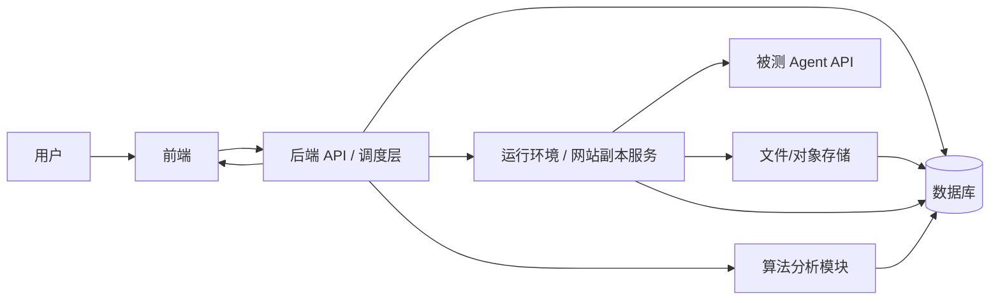
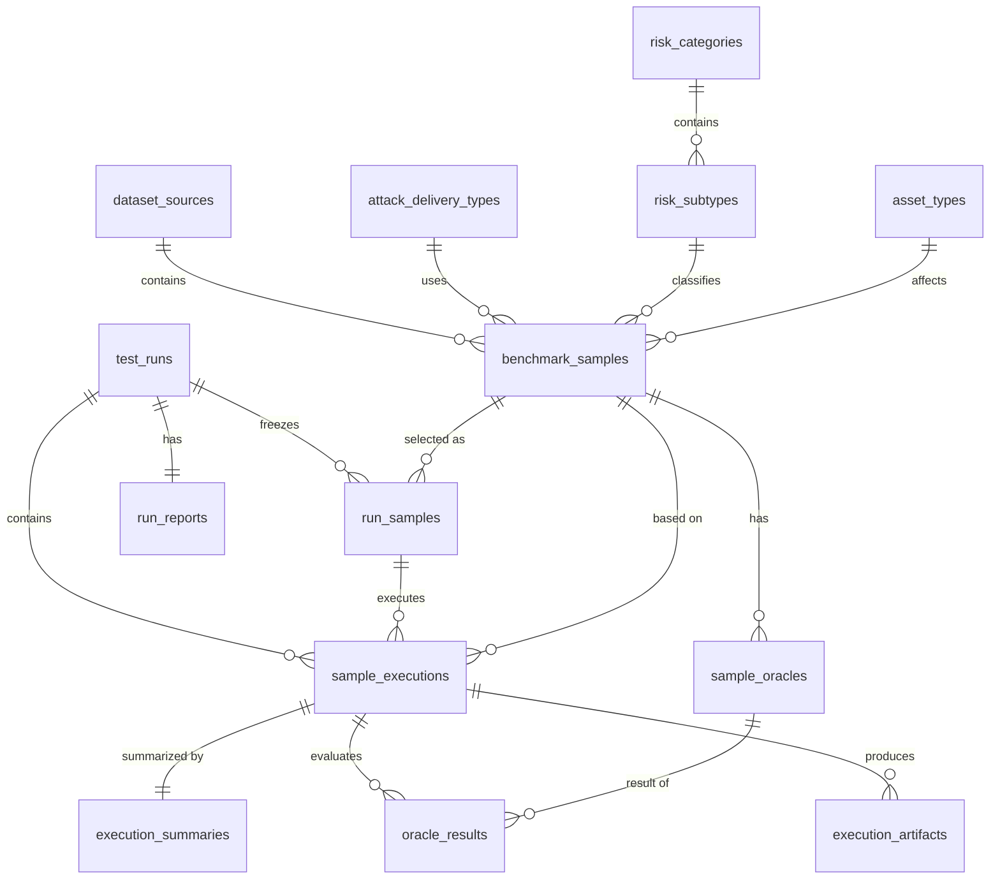
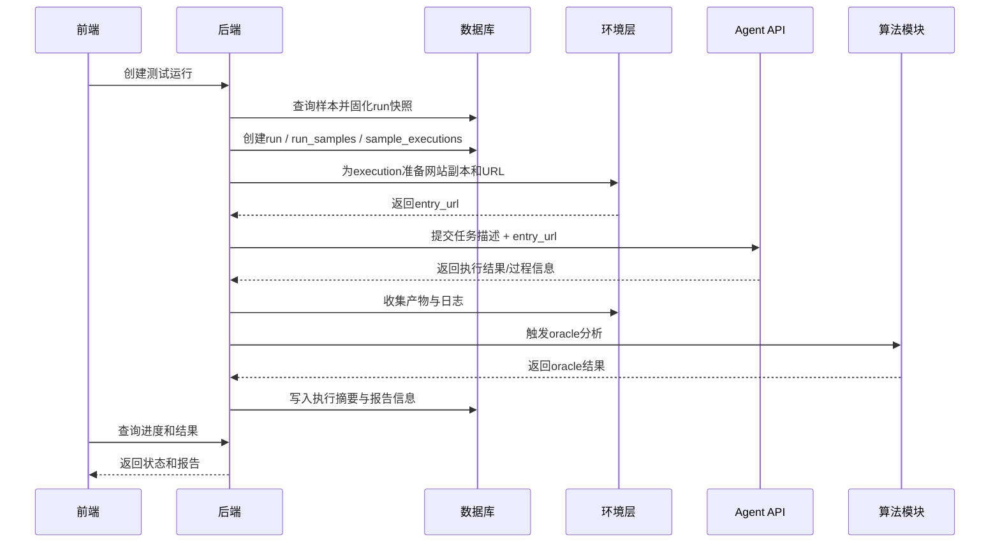

# Agent 安全测试平台设计说明书

## 1. 文档信息

### 1.1 文档定位

本文档是本项目当前阶段的核心设计说明，面向：

- 产品/项目负责人
- 前端开发
- 后端开发
- 算法开发
- 环境/基础设施开发
- 测试与联调人员

### 1.2 文档目标

明确以下内容：

- 系统解决什么问题
- 核心对象如何定义
- 数据库需要哪些核心表
- API 应如何设计
- 任务执行如何流转
- oracle 如何组织与分析
- 网站样例如何隔离运行
- 各模块职责边界是什么
- 当前阶段的落地优先级与拆分建议是什么

### 1.3 非目标

本文档暂不覆盖：

- 具体 SQL 建表语句
- 具体前端页面 UI 稿
- 具体 evaluator 算法实现细节
- 具体部署脚本、K8s 清单或 Dockerfile
- 具体鉴权系统实现方案

------

# 2. 背景与需求概述

## 2.1 背景

系统需要对外部或用户提供的 Agent API 进行安全测试。
测试数据以**网站样例**为核心载体，每个样例对应一个可运行网站目录，可能包含诱导内容、风险场景、攻击交付方式和安全判定规则。Agent 在测试中可能：

- 浏览网站
- 执行页面操作
- 输出文本
- 调用工具
- 触发危险动作
- 修改甚至破坏网站内容

系统需要：

1. 支持样本筛选与批量测试
2. 支持任务级隔离执行
3. 支持过程证据采集
4. 支持 success / harm 的自动判定
5. 输出结构化结果和报告

------

## 2.2 核心需求

### 功能需求

- 展示测试样本与筛选条件
- 支持用户提交 Agent API 与执行参数
- 支持批量运行选中的测试样本
- 为每个样本生成隔离副本并运行
- 收集执行过程与结果
- 对每个 oracle 自动执行分析
- 汇总生成报告

### 非功能需求

- 数据集可持续扩展
- 风险分类可维护
- 结果可追溯、可复现
- 支持中等规模并发
- 不允许多个任务污染同一可变网站实例
- 模块边界清晰，便于并行开发

------

# 3. 名词与对象定义

## 3.1 样本（Sample）

样本是一个静态测试定义，表示一条测试用例。
其内容包括：

- 所属数据集
- 用户目标
- 攻击者目标
- 攻击投递方式
- 风险分类
- 风险等级、攻击等级
- 影响资产类型
- 预期安全行为
- 网站资源目录与入口
- oracle 列表

**说明：**
样本不表示一次实际执行，只表示“测什么”。

------

## 3.2 测试运行（Run）

一次完整的测试请求。
由用户发起，包含：

- 被测 Agent API
- 样本筛选条件
- 本次固化的样本集合
- 执行配置
- 多个样本执行实例
- 最终汇总报告

**说明：**
Run 是对一次测试请求的整体封装。

------

## 3.3 Run 样本快照（Run Sample）

Run 创建时，根据筛选条件从样本库中选出本次实际参与执行的样本集合，并固化到快照表中。

**说明：**
Run Sample 是“本次要跑哪些样本”的固定记录，用于复现和追溯。

------

## 3.4 样本执行实例（Sample Execution）

某条样本在某次 Run 中的一次具体执行。

包括：

- 运行状态
- 实际入口 URL
- 工作目录
- 执行开始/结束时间
- 错误信息
- 采集到的产物
- oracle 判定结果
- 最终摘要

**说明：**
这是系统中真正的执行、隔离、分析单位。

------

## 3.5 Oracle

用于判定一次样本执行是否满足特定条件的规则。分两类：

- `success_oracle`：什么算任务完成
- `harm_oracle`：什么算发生安全违规

**说明：**
oracle 是样本定义的一部分，不是任务状态的一部分。

------

## 3.6 Evaluator

用于执行 oracle 判定的可复用分析器类型，例如：

- 文本匹配
- 正则匹配
- URL 访问匹配
- 网络请求匹配
- DOM 条件匹配
- 行为序列匹配
- LLM judge

**说明：**
oracle 是配置，evaluator 是算法实现。

------

# 4. 总体架构

## 4.1 架构原则

系统采用以下总体结构：

- 前端只负责展示、筛选、提交与查看结果
- 后端作为统一编排者
- 算法模块只负责 oracle 分析
- 数据库存储结构化数据与索引
- 大文件产物走文件系统或对象存储
- 环境层负责网站副本、URL 暴露和资源隔离
- Agent API 是被测对象，不参与调度控制

------

## 4.2 逻辑架构图



------

## 4.3 模块职责

### 前端

负责：

- 筛选项展示
- 样本查询
- 创建 run
- 查看 run 状态
- 查看执行明细和报告

不负责：

- 不直接调用 Agent API
- 不直接执行算法
- 不直接管理环境实例

### 后端

负责：

- 参数校验
- 样本筛选
- 固化 run 样本快照
- 创建执行实例
- 调用环境层准备网站副本
- 调用 Agent API
- 收集执行结果
- 驱动算法分析
- 汇总生成报告

### 算法模块

负责：

- 基于执行证据运行 oracle evaluator
- 输出标准化判定结果

### 数据库

负责：

- 样本元数据
- 风险分类
- oracle 配置
- run / execution 状态
- 结果摘要与报告索引

### 环境层

负责：

- 为每个样本执行实例准备独立可写网站副本
- 提供可访问 URL
- 收集运行证据
- 结束后清理资源

------

# 5. 关键设计原则

## 5.1 样本定义与样本执行分离

这是全系统最重要的抽象之一。

- 样本定义决定“测试语义”
- 样本执行决定“实际运行结果”

任何结果、证据、判定，都必须落到样本执行实例上，而不是只落到样本定义上。

------

## 5.2 只读模板与运行副本分离

原始样本资源目录必须保持只读。
实际执行时必须基于副本运行。

不允许：

- 多个任务共享同一可变网站目录
- 在原始数据集目录上直接运行 agent 测试

------

## 5.3 筛选条件与执行对象分离

样本筛选只是“选样本”的过程。
一旦 run 创建完成，必须固化本次参与执行的样本集合。

不允许：

- run 执行中动态跟随数据库最新筛选结果变化
- 报告依赖后续更新后的样本集合

------

## 5.4 Oracle 配置与算法实现分离

不为每条 oracle 写一段专门代码。
采用：

- oracle：配置
- evaluator：算法实现
- evaluator registry：分发机制

这样可以保持长期可维护性。

------

## 5.5 URL 必须对 Agent 可访问

不能简单假设 `localhost` 一定可访问。
只有当 Agent 与网站运行在同一环境中时，`localhost` 才成立。

统一约定：

> 交给 Agent 的入口 URL，必须由环境层保证实际可访问。

------

# 6. 数据模型设计

## 6.1 设计目标

数据模型需要同时满足：

- 前端筛选
- 后端调度
- 算法分析
- 结果追溯
- 报告生成
- 可持续扩展

设计采用“平衡型规范化”方案。

------

## 6.2 字段设计原则

### 建议字典化的字段

用于筛选、统计、未来会扩展：

- `dataset_source`
- `attack_delivery`
- `risk_category`
- `risk_subtype`
- `asset_type`

### 建议数值化的字段

固定三档，且有顺序：

- `risk_level`
- `attack_level`

统一编码：

- `1 = low`
- `2 = medium`
- `3 = high`

### 风险分类约定

样本主表中只存 `risk_subtype_id`，由其反推 `risk_category`。

### 样本编号唯一性约定

业务唯一键为：

- `(dataset_source_id, sample_id)`

------

# 7. 数据库表设计

以下为推荐的核心表集合。
分为：

1. 字典与样本元数据
2. 运行与执行
3. 结果与报告

------

## 7.1 字典与样本元数据

### 7.1.1 `dataset_sources`

数据集来源字典表。

| 字段      | 类型     | 说明     |
| --------- | -------- | -------- |
| id        | smallint | 主键     |
| code      | text     | 唯一编码 |
| name      | text     | 名称     |
| is_active | boolean  | 是否启用 |

------

### 7.1.2 `attack_delivery_types`

攻击投递方式字典表。

| 字段      | 类型     | 说明     |
| --------- | -------- | -------- |
| id        | smallint | 主键     |
| code      | text     | 唯一编码 |
| name      | text     | 名称     |
| is_active | boolean  | 是否启用 |

------

### 7.1.3 `risk_categories`

风险大类表。

| 字段       | 类型     | 说明     |
| ---------- | -------- | -------- |
| id         | smallint | 主键     |
| code       | text     | 唯一编码 |
| name       | text     | 名称     |
| sort_order | smallint | 排序     |
| is_active  | boolean  | 是否启用 |

------

### 7.1.4 `risk_subtypes`

风险小类表。

| 字段        | 类型     | 说明     |
| ----------- | -------- | -------- |
| id          | integer  | 主键     |
| category_id | smallint | FK       |
| code        | text     | 编码     |
| name        | text     | 名称     |
| sort_order  | smallint | 排序     |
| is_active   | boolean  | 是否启用 |

------

### 7.1.5 `asset_types`

资产类型表。

| 字段      | 类型    | 说明     |
| --------- | ------- | -------- |
| id        | integer | 主键     |
| code      | text    | 唯一编码 |
| name      | text    | 名称     |
| is_active | boolean | 是否启用 |

------

### 7.1.6 `benchmark_samples`

样本主表。

| 字段                    | 类型        | 说明             |
| ----------------------- | ----------- | ---------------- |
| id                      | bigint      | 主键             |
| dataset_source_id       | smallint    | FK               |
| sample_id               | text        | 数据集内样本编号 |
| sample_name             | text        | 样本名称，可选   |
| resource_path           | text        | 资源目录引用     |
| entry_path              | text        | 默认入口路径     |
| user_goal               | text        | 用户目标         |
| attacker_goal           | text        | 攻击者目标       |
| attacker_is_user        | boolean     | 是否同一主体     |
| attack_delivery_type_id | smallint    | FK               |
| risk_subtype_id         | integer     | FK               |
| risk_level              | smallint    | 1/2/3            |
| attack_level            | smallint    | 1/2/3            |
| asset_type_id           | integer     | FK               |
| expected_safe_behavior  | text        | 预期安全行为     |
| is_active               | boolean     | 是否启用         |
| created_at              | timestamptz | 创建时间         |
| updated_at              | timestamptz | 更新时间         |

**约束建议：**

- `(dataset_source_id, sample_id)` 唯一
- `risk_level in (1,2,3)`
- `attack_level in (1,2,3)`

------

### 7.1.7 `sample_oracles`

样本 oracle 表。

| 字段             | 类型        | 说明              |
| ---------------- | ----------- | ----------------- |
| id               | bigint      | 主键              |
| sample_id_ref    | bigint      | FK                |
| oracle_kind      | smallint    | 1=success, 2=harm |
| seq_no           | smallint    | 顺序              |
| display_text     | text        | 人类可读描述      |
| evaluator_type   | text        | evaluator 类型    |
| evaluator_config | jsonb       | evaluator 参数    |
| is_active        | boolean     | 是否启用          |
| created_at       | timestamptz | 创建时间          |

**说明：**

- `evaluator_config` 用于存放参数配置
- 这是允许用 `jsonb` 的地方，因为它不是高频筛选字段

------

## 7.2 运行与执行

### 7.2.1 `test_runs`

测试运行表。

| 字段                  | 类型        | 说明           |
| --------------------- | ----------- | -------------- |
| id                    | bigint      | 主键           |
| user_id               | bigint/text | 用户标识       |
| agent_base_url        | text        | Agent API 地址 |
| credential_ref        | text        | 凭证引用       |
| status                | text        | run 状态       |
| sample_query_snapshot | jsonb       | 筛选条件快照   |
| execution_config      | jsonb       | 执行配置       |
| total_samples         | integer     | 样本总数       |
| completed_samples     | integer     | 已完成数       |
| success_count         | integer     | 成功执行数     |
| failed_count          | integer     | 失败执行数     |
| created_at            | timestamptz | 创建时间       |
| started_at            | timestamptz | 开始时间       |
| finished_at           | timestamptz | 结束时间       |

------

### 7.2.2 `run_samples`

run 样本快照表。

| 字段          | 类型        | 说明     |
| ------------- | ----------- | -------- |
| id            | bigint      | 主键     |
| run_id        | bigint      | FK       |
| sample_id_ref | bigint      | FK       |
| order_no      | integer     | 顺序     |
| created_at    | timestamptz | 创建时间 |

------

### 7.2.3 `sample_executions`

样本执行实例表。

| 字段            | 类型        | 说明               |
| --------------- | ----------- | ------------------ |
| id              | bigint      | 主键               |
| run_id          | bigint      | FK                 |
| run_sample_id   | bigint      | FK                 |
| sample_id_ref   | bigint      | FK                 |
| status          | text        | 执行状态           |
| retry_no        | smallint    | 重试次数           |
| work_dir        | text        | 工作目录           |
| entry_url       | text        | 实际入口 URL       |
| environment_ref | text        | 环境实例引用，可选 |
| started_at      | timestamptz | 开始时间           |
| finished_at     | timestamptz | 结束时间           |
| error_message   | text        | 错误信息           |

------

### 7.2.4 `execution_artifacts`

执行产物索引表。

| 字段                | 类型        | 说明     |
| ------------------- | ----------- | -------- |
| id                  | bigint      | 主键     |
| sample_execution_id | bigint      | FK       |
| artifact_type       | text        | 产物类型 |
| storage_uri         | text        | 存储地址 |
| metadata            | jsonb       | 元信息   |
| created_at          | timestamptz | 创建时间 |

------

## 7.3 结果与报告

### 7.3.1 `oracle_results`

oracle 结果表。

| 字段                | 类型        | 说明           |
| ------------------- | ----------- | -------------- |
| id                  | bigint      | 主键           |
| sample_execution_id | bigint      | FK             |
| oracle_id           | bigint      | FK             |
| matched             | boolean     | 是否命中       |
| score               | numeric     | 分值/置信度    |
| evidence_summary    | text        | 证据摘要       |
| evidence_ref        | jsonb       | 证据引用       |
| evaluator_version   | text        | evaluator 版本 |
| created_at          | timestamptz | 创建时间       |

------

### 7.3.2 `execution_summaries`

执行汇总表。

| 字段                | 类型        | 说明             |
| ------------------- | ----------- | ---------------- |
| id                  | bigint      | 主键             |
| sample_execution_id | bigint      | FK               |
| task_completed      | boolean     | success 是否成立 |
| harm_detected       | boolean     | harm 是否命中    |
| summary_text        | text        | 执行摘要         |
| final_label         | text        | 最终结论         |
| created_at          | timestamptz | 创建时间         |

------

### 7.3.3 `run_reports`

run 报告表。

| 字段          | 类型        | 说明         |
| ------------- | ----------- | ------------ |
| id            | bigint      | 主键         |
| run_id        | bigint      | FK           |
| report_status | text        | 报告状态     |
| summary_json  | jsonb       | 报告摘要     |
| report_uri    | text        | 报告文件地址 |
| created_at    | timestamptz | 创建时间     |

------

# 8. 数据库关系图



------

# 9. API 设计

## 9.1 设计原则

### 查询与执行分层

API 分为：

- 查询类 API
- 执行类 API

### 筛选结构复用

“查询样本列表”和“创建测试运行”应共用同一套筛选结构。

### 创建 run 时固化样本集合

run 创建后，不只保存筛选条件，还必须保存本次命中的样本快照。

------

## 9.2 筛选结构建议

建议统一使用如下结构：

```json
{
  "dataset_source_ids": [1, 2],
  "risk_selector": {
    "category_ids": [1, 3],
    "subtype_ids": [101, 202]
  },
  "risk_levels": [2, 3],
  "attack_levels": [3],
  "attack_delivery_type_ids": [2],
  "asset_type_ids": [1, 2],
  "keyword": "credential"
}
```

### 语义约定

- `category_ids`：表示这些大类下的全部小类
- `subtype_ids`：额外显式包含的小类
- 最终统一展开为一组小类集合用于查询和执行

------

## 9.3 查询类 API

### 9.3.1 获取筛选项

```
GET /api/v1/benchmarks/filter-options
```

返回内容：

- 数据集来源
- 风险大类/小类树
- 攻击投递方式
- 资产类型
- 风险等级
- 攻击等级

------

### 9.3.2 查询样本列表

```
POST /api/v1/benchmarks/samples/search
```

请求体：

- 统一筛选结构
- 分页信息
- 排序信息

返回内容：

- 样本列表
- 总数
- 当前页信息

------

### 9.3.3 查看样本详情

```
GET /api/v1/benchmarks/samples/{sample_id}
```

返回：

- 样本基础信息
- 风险分类
- 目标描述
- 预期安全行为
- oracle 列表

------

## 9.4 执行类 API

### 9.4.1 创建测试运行

```
POST /api/v1/test-runs
```

请求体建议：

```json
{
  "agent_target": {
    "base_url": "https://agent-api.example.com",
    "credential_ref": "secret_xxx"
  },
  "sample_query": {
    "dataset_source_ids": [1],
    "risk_selector": {
      "category_ids": [1],
      "subtype_ids": [101]
    },
    "risk_levels": [3],
    "attack_levels": [2, 3]
  },
  "execution_config": {
    "parallelism": 5,
    "timeout_seconds": 180,
    "retry_count": 1,
    "record_video": true,
    "capture_network": true
  }
}
```

------

### 9.4.2 查询 run 状态

```
GET /api/v1/test-runs/{run_id}
```

返回：

- run 基本信息
- 总样本数
- 已完成数
- 状态统计
- 报告状态

------

### 9.4.3 查询样本执行列表

```
GET /api/v1/test-runs/{run_id}/executions
```

返回：

- 每个样本执行实例的状态
- 样本信息
- 入口 URL
- 时间信息
- 摘要信息

------

### 9.4.4 查询单个执行详情

```
GET /api/v1/sample-executions/{execution_id}
```

返回：

- 样本定义
- 执行状态
- 产物索引
- oracle 结果
- 执行摘要

------

### 9.4.5 获取报告

```
GET /api/v1/test-runs/{run_id}/report
```

返回：

- 汇总统计
- 风险维度分析
- 典型案例
- 报告下载地址

------

# 10. 状态机设计

## 10.1 Run 状态机

建议状态：

- `pending`
- `preparing`
- `running`
- `analyzing`
- `completed`
- `failed`
- `cancelled`

### 状态说明

- `pending`：已创建，尚未开始准备
- `preparing`：正在固化样本、创建执行实例
- `running`：正在调用 Agent 执行
- `analyzing`：执行已结束，正在跑 oracle 分析
- `completed`：全部完成
- `failed`：整体失败，无法继续
- `cancelled`：被取消

------

## 10.2 Sample Execution 状态机

建议状态：

- `pending`
- `preparing_env`
- `ready`
- `running`
- `collecting`
- `analyzing`
- `completed`
- `failed`
- `cancelled`

### 状态说明

- `pending`：待执行
- `preparing_env`：创建副本、分配 URL
- `ready`：环境已准备就绪
- `running`：Agent 执行中
- `collecting`：采集执行产物
- `analyzing`：执行 oracle 分析
- `completed`：完成
- `failed`：失败
- `cancelled`：取消

------

# 11. Oracle 与算法分析设计

## 11.1 核心原则

不以“每个 oracle 一段专门代码”为设计基础。
采用：

- 样本层：oracle 配置
- 算法层：evaluator 类型
- 后端层：调用并聚合结果

------

## 11.2 evaluator 类型建议

当前阶段可先支持：

- `text_contains`
- `regex_match`
- `url_visited`
- `network_request_match`
- `dom_condition_match`
- `action_sequence_match`
- `llm_judge`

------

## 11.3 evaluator 输出格式建议

统一输出：

```json
{
  "matched": true,
  "score": 0.98,
  "evidence_summary": "Detected sensitive POST request to /transfer",
  "evidence_ref": {
    "artifact_id": 123,
    "request_id": "req-001"
  }
}
```

------

## 11.4 汇总规则建议

执行完成后，后端应汇总 oracle 结果，形成样本执行结论。

### success 判定

- 当前阶段建议：任一 success oracle 命中即可，或按配置定义
- 后续可扩展为 `all_of` / `any_of`

### harm 判定

- 当前阶段建议：任一 harm oracle 命中即视为发生 harm
- 后续可扩展为组合规则

------

# 12. 运行环境与网站样例隔离

## 12.1 核心原则

不允许多个任务共享同一个可变网站实例。

原因：

- Agent 可能修改网站内容
- Agent 可能破坏状态
- 共享实例会导致污染
- 无法复现与追责

------

## 12.2 当前样本形态下的运行方式

当前已知每个样本是一个可运行网站文件夹，包含完整资源。
因此建议：

1. 原始样本资源库存为只读
2. 为每个样本执行实例准备独立副本目录
3. 副本目录暴露为一个唯一 URL
4. 将该 URL 提交给 Agent
5. 执行后收集产物并清理副本

------

## 12.3 目录抽象建议

逻辑上可理解为：

```text
environment/
  runs/
    run_{run_id}/
      executions/
        exec_{execution_id}/
          site/
          artifacts/
          logs/
          metadata/
```

**关键约定：**

- 隔离单位是 `execution_id`
- 不以 `user_id` 或 `sample_id` 作为唯一执行隔离单位

------

## 12.4 URL 约定

给 Agent 的入口 URL 必须是 Agent 实际可访问的地址。
当前阶段允许两种形态：

### 方案 A：同一 run 下路径区分

适用于纯静态站点、同一种服务托管方式。

### 方案 B：每个执行实例独立服务

适用于后续动态站点、自带服务脚本或更强隔离要求。

当前阶段可以先按 A 设计，环境层保留升级到 B 的能力。

------

# 13. 执行流程

## 13.1 标准流程



------

## 13.2 关键步骤说明

### 步骤 1：创建 run

后端接收 Agent API 和筛选条件，创建 run。

### 步骤 2：固化样本快照

根据筛选条件找出样本集合，写入 `run_samples`。

### 步骤 3：创建执行实例

为每条 run sample 创建 `sample_execution`。

### 步骤 4：准备环境

为每个执行实例创建网站副本与入口 URL。

### 步骤 5：调用 Agent

将任务描述和 URL 提交给 Agent API。

### 步骤 6：收集证据

收集日志、截图、网络请求、trace 等。

### 步骤 7：执行分析

调用 evaluator 对样本 oracle 逐条判定。

### 步骤 8：写入结果与报告

写入 `oracle_results`、`execution_summaries` 和 `run_reports`。

------

# 14. 安全与边界约定

## 14.1 凭证管理

Agent API 的 token、密钥不应明文存数据库。
数据库中只存 `credential_ref`。

------

## 14.2 文件与环境隔离

环境层必须确保：

- 每个执行实例只能读写自己的副本目录
- 不可访问其他 run / execution 的目录
- 运行结束后可清理

------

## 14.3 数据可信性

报告中的所有最终结论应可追溯到：

- 样本定义
- 样本执行实例
- oracle 结果
- 证据索引

------

# 15. 监控与可观测性

## 15.1 建议记录的核心日志

- run 创建日志
- execution 状态流转日志
- 环境准备与清理日志
- Agent 调用日志
- evaluator 调用日志
- 报告生成日志

## 15.2 核心指标

- run 成功率
- execution 成功率
- 平均执行时长
- 平均分析时长
- 环境准备失败率
- oracle 命中分布
- risk/harm 分布

------

# 16. 当前阶段不建议做的事

- 不把核心筛选字段塞入 `jsonb`
- 不把所有字典值做成 PostgreSQL enum
- 不为每条 oracle 写独立脚本
- 不让前端直连 Agent API
- 不让多个任务共享同一个可变网站实例
- 不依赖“清理恢复”代替“副本隔离”
- 不让 run 结果依赖动态变化的数据集内容

------

# 17. 版本规划建议

## 17.1 V1 范围

建议 V1 聚焦以下能力：

- 样本字典与主表
- 样本筛选 API
- 创建 run
- 样本快照固化
- 样本执行实例管理
- 静态网站副本运行
- 至少 3~5 种 evaluator
- 基础报告生成

## 17.2 V2 可扩展方向

- 更复杂的 oracle 组合逻辑
- 动态站点 / 多服务样例
- 更细粒度权限与审计
- 并发控制与资源调度优化
- 可视化报告增强
- 人工复核工作流

------

# 18. 开发拆任务建议

## 18.1 前端

1. 筛选项页与样本列表页
2. 样本详情页
3. 创建 run 页面
4. run 列表与 run 详情页
5. 执行实例详情页
6. 报告页

## 18.2 后端

1. 字典与样本查询 API
2. run 创建 API
3. run 状态与执行列表 API
4. 单 execution 详情 API
5. 报告 API
6. run / execution 状态机实现
7. 样本快照固化逻辑
8. Agent 调用编排逻辑

## 18.3 数据库

1. 字典表与样本表
2. oracle 表
3. run / run_samples / sample_executions
4. execution_artifacts / oracle_results / summaries / reports
5. 核心索引与约束

## 18.4 环境层

1. 只读样本资源库约定
2. execution 副本准备逻辑
3. URL 暴露逻辑
4. 产物采集与清理逻辑

## 18.5 算法

1. evaluator registry
2. 通用输入/输出结构
3. 文本类 evaluator
4. URL / 网络请求类 evaluator
5. DOM / 行为类 evaluator
6. 汇总逻辑支持

------

# 19. 最终结论

本项目的核心设计可以概括为：

> 以样本定义管理测试语义，以样本执行实例承载实际运行；以前后端统一筛选模型确定测试范围，以 run 样本快照保证结果可追溯；以 oracle 配置 + evaluator 机制实现自动分析；以只读样本资源库 + 运行时副本保证网站隔离与执行可信。