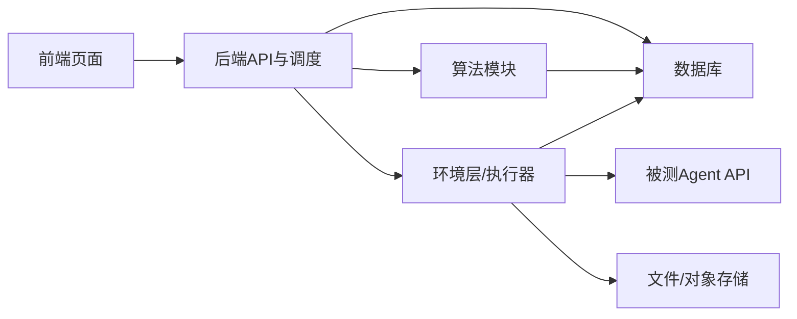

# 一、《后端开发任务拆解清单》

## 1. 目标

后端负责整个系统的统一编排。
V1 阶段后端目标是打通以下主链路：

**样本查询 → 创建 run → 固化样本快照 → 创建执行实例 → 调用环境层准备网站副本 → 调用 Agent API → 收集结果 → 调用算法分析 → 生成 run 报告**

------

## 2. 后端模块划分

建议按 8 个模块拆分：

| 模块                  | 说明                                                       |
| --------------------- | ---------------------------------------------------------- |
| A. 字典与样本查询模块 | 提供筛选项、样本查询、样本详情                             |
| B. Run 管理模块       | 创建 run、查询 run 状态                                    |
| C. 样本快照模块       | 固化本次 run 的样本集合                                    |
| D. Execution 管理模块 | 创建与管理样本执行实例                                     |
| E. Agent 调度模块     | 调用 Agent API，管理超时、重试、状态更新                   |
| F. 分析调度模块       | 调用 evaluator，写入 oracle_results 和 execution_summaries |
| G. 报告汇总模块       | 生成 run 报告与统计汇总                                    |
| H. 通用基础模块       | 认证、错误码、日志、状态机、配置管理                       |

------

## 3. 任务拆解

------

## A. 字典与样本查询模块

### A1. 实现筛选项聚合接口

**目标**
提供前端样本筛选所需全部字典项。

**输入**

- 无

**输出**

- dataset_sources
- risk_tree
- risk_levels
- attack_levels
- attack_delivery_types
- asset_types

**依赖**

- 字典表已存在并有初始化数据

**完成标准**

- 能一次性返回前端所需所有筛选项
- 返回结构符合 API 约定
- 风险树按大类-小类结构返回

------

### A2. 实现样本搜索接口

**目标**
支持前端组合条件筛选样本。

**输入**

- `dataset_source_ids`
- `risk_selector`
- `risk_levels`
- `attack_levels`
- `attack_delivery_type_ids`
- `asset_type_ids`
- `keyword`
- `page`
- `page_size`
- `sort`

**输出**

- 分页样本列表

**依赖**

- 样本主表与相关字典表
- 查询视图或 join 查询实现

**完成标准**

- 支持组合筛选
- 风险大类与风险小类筛选语义正确
- 分页与排序正确
- 可返回样本总数

------

### A3. 实现样本详情接口

**目标**
提供单个样本的完整定义信息。

**输入**

- sample 主键

**输出**

- 样本基础信息
- 风险信息
- 目标信息
- 预期安全行为
- oracle 列表

**依赖**

- `benchmark_samples`
- `sample_oracles`

**完成标准**

- 能正确返回 success/harm oracle
- 不泄露内部资源路径等不必要信息

------

## B. Run 管理模块

### B1. 实现创建 run 接口

**目标**
接收 Agent API 信息、筛选条件和执行配置，创建一条 run。

**输入**

- `agent_target`
- `sample_query`
- `execution_config`

**输出**

- `run_id`
- `status`
- `total_samples`

**依赖**

- 参数校验模块
- 样本查询模块
- run 样本快照模块

**完成标准**

- 创建 run 时同时完成样本快照固化
- 如果样本集合为空，拒绝创建
- 初始状态正确写入

------

### B2. 实现 run 查询接口

**目标**
提供 run 的基础状态和统计信息。

**输入**

- run_id

**输出**

- run 状态
- 总样本数
- 已完成数
- 成功/失败数
- 报告状态

**依赖**

- `test_runs`
- `run_reports`

**完成标准**

- 状态统计正确
- 不依赖异步补算才可读取基本状态

------

## C. 样本快照模块

### C1. 实现样本快照固化逻辑

**目标**
根据筛选条件查出本次执行样本集合，并写入 `run_samples`。

**输入**

- run_id
- sample_query

**输出**

- run_samples 记录
- total_samples

**依赖**

- 样本搜索逻辑
- 事务支持

**完成标准**

- 固化结果与创建 run 时前端预览语义一致
- 同一个 run 内样本集合固定不变
- 保证 `(run_id, sample_id_ref)` 不重复

------

### C2. 实现快照一致性校验

**目标**
保证 run 结果只依赖快照，不依赖后续样本表变化。

**输入**

- run_id

**输出**

- 一致性检查结果

**依赖**

- `run_samples`

**完成标准**

- 所有执行实例均以 `run_samples` 为源创建
- 报告汇总以 `run_samples` 为基准

------

## D. Execution 管理模块

### D1. 实现 execution 创建逻辑

**目标**
为每条 run sample 创建一条或多条 `sample_executions`。

**输入**

- run_id
- run_sample 列表
- retry_count

**输出**

- `sample_executions`

**依赖**

- `run_samples`
- `sample_executions`

**完成标准**

- 每个 run sample 至少有一条 execution
- execution 初始状态为 `pending`
- retry_no 合法

------

### D2. 实现 execution 状态机

**目标**
统一管理 execution 的状态流转。

**输入**

- 当前状态
- 事件或动作

**输出**

- 下一个状态

**依赖**

- 状态机工具或统一状态校验逻辑

**完成标准**

- 禁止非法状态跳转
- 状态变更有日志
- 失败时能记录 error_message

------

### D3. 实现 execution 列表接口

**目标**
供前端查看 run 下所有执行实例。

**输入**

- run_id
- 可选状态过滤
- 分页参数

**输出**

- execution 列表

**依赖**

- `sample_executions`
- `execution_summaries`

**完成标准**

- 支持分页
- 可展示执行摘要
- 状态过滤正确

------

### D4. 实现 execution 详情接口

**目标**
提供单次执行的完整信息。

**输入**

- execution_id

**输出**

- 基础状态
- 样本信息
- 产物索引
- oracle 结果
- 执行摘要

**依赖**

- `sample_executions`
- `execution_artifacts`
- `oracle_results`
- `execution_summaries`

**完成标准**

- 返回结构清晰
- 可追溯单次执行结果

------

## E. Agent 调度模块

### E1. 实现 Agent 调用适配层

**目标**
统一封装对外部 Agent API 的调用。

**输入**

- base_url
- credential_ref
- 任务描述
- entry_url
- timeout

**输出**

- Agent 响应
- 调用状态
- 错误信息

**依赖**

- HTTP client
- 凭证读取能力

**完成标准**

- 能处理正常返回
- 能处理超时
- 能处理非 2xx 响应
- 不在日志中输出敏感凭证

------

### E2. 实现 execution 执行编排

**目标**
驱动单个 execution 从准备环境到调用 Agent，再到产物收集。

**输入**

- execution_id

**输出**

- execution 状态更新
- Agent 原始请求/响应产物索引

**依赖**

- 环境层 API
- Agent 调用适配层
- 产物索引写入能力

**完成标准**

- 正常情况下能完整跑通
- 异常时 execution 状态更新为 `failed`
- 产物索引写入完整

------

### E3. 实现超时与重试机制

**目标**
支持 execution 超时和受控重试。

**输入**

- timeout_seconds
- retry_count

**输出**

- 重试或失败结果

**依赖**

- execution 状态机
- 调度器

**完成标准**

- 超时会终止本次执行
- 重试不会复用已污染的 execution 副本
- retry_no 正确累加

------

## F. 分析调度模块

### F1. 实现 evaluator registry

**目标**
建立 evaluator 类型到实现的映射关系。

**输入**

- `evaluator_type`

**输出**

- 对应 evaluator 实例

**依赖**

- 算法模块接口定义

**完成标准**

- 新 evaluator 可插拔注册
- 未注册 evaluator 有明确错误

------

### F2. 实现 oracle 分析编排

**目标**
对某次 execution 的所有 oracle 逐条分析。

**输入**

- execution_id
- execution 证据
- 样本 oracle 列表

**输出**

- `oracle_results`

**依赖**

- `sample_oracles`
- evaluator registry
- execution 证据读取能力

**完成标准**

- success/harm oracle 都可执行
- 分析结果标准化写入
- 单条 oracle 分析失败不应导致整个 run 直接崩溃，需有明确策略

------

### F3. 实现 execution 汇总结论

**目标**
根据 oracle_results 生成最终 execution 摘要。

**输入**

- execution_id
- oracle_results

**输出**

- `execution_summaries`

**依赖**

- 汇总规则

**完成标准**

- 可得出 `task_completed`
- 可得出 `harm_detected`
- 生成 summary_text

------

## G. 报告汇总模块

### G1. 实现 run 级统计汇总

**目标**
将所有 execution 的结果汇总为 run 级统计。

**输入**

- run_id

**输出**

- 汇总 JSON

**依赖**

- `sample_executions`
- `execution_summaries`
- 样本风险分类信息

**完成标准**

- 能按风险大类统计
- 能按危险程度统计
- 能按攻击程度统计
- 能给出总样本数、完成数、harm 数

------

### G2. 实现报告生成接口

**目标**
提供前端读取报告。

**输入**

- run_id

**输出**

- report_status
- summary
- report_uri

**依赖**

- `run_reports`

**完成标准**

- 报告状态正确
- 无报告时返回明确状态
- 有报告时返回可用地址或汇总内容

------

## H. 通用基础模块

### H1. 参数校验

**目标**
统一校验筛选结构、分页、排序、创建 run 参数。

**完成标准**

- 不合法字段返回统一错误码
- 风险筛选结构语义可校验

------

### H2. 错误码与异常处理

**目标**
统一业务错误码与 HTTP 状态码。

**完成标准**

- 查询/创建/执行/分析/报告错误均可归类
- 前端可基于错误码处理

------

### H3. 日志与追踪

**目标**
记录 run 和 execution 的关键操作日志。

**完成标准**

- 每次状态流转有日志
- Agent 调用有 request_id / execution_id 关联
- evaluator 调用可追溯

------

## 4. 后端开发顺序建议

| 阶段 | 优先任务                                               |
| ---- | ------------------------------------------------------ |
| P0   | 字典与样本查询、数据库模型、参数校验                   |
| P1   | 创建 run、样本快照、execution 创建、run/execution 查询 |
| P2   | 环境层对接、Agent 调用链路、状态机                     |
| P3   | oracle 分析、execution 汇总                            |
| P4   | run 报告生成、统计接口                                 |
| P5   | 重试、优化、日志、监控完善                             |

------

## 5. 后端联调完成标准

V1 后端完成的判定标准：

1. 能查询样本与详情
2. 能创建 run 且固化样本快照
3. 能为每个样本创建 execution
4. 能驱动 execution 进入运行流程
5. 能写入 oracle_results 与 execution_summaries
6. 能生成 run 报告摘要
7. 前端可完整查看 run 和 execution 结果

------

# 二、《前端页面与接口对照清单》

## 1. 目标

前端的核心目标是把后端主链路清晰地呈现给用户。
V1 前端重点不是复杂交互，而是：

- 看得见样本
- 能筛选样本
- 能发起测试
- 能看到进度
- 能看结果与报告

------

## 2. 页面划分

建议拆成 6 个页面/区域：

1. 样本筛选与列表页
2. 样本详情页
3. 创建测试运行页
4. Run 列表页
5. Run 详情页
6. Execution 详情页
7. 报告页（可并入 Run 详情页，V1 可合并）

------

## 3. 页面与接口对照

------

## 页面 1：样本筛选与列表页

### 页面目标

- 展示筛选项
- 展示样本列表
- 支持组合筛选
- 支持预览本次将测试的样本范围

### 需要调用的接口

| 接口                                     | 用途         |
| ---------------------------------------- | ------------ |
| `GET /api/v1/benchmarks/filter-options`  | 获取筛选项   |
| `POST /api/v1/benchmarks/samples/search` | 查询样本列表 |

### 页面核心组件

| 组件              | 说明           |
| ----------------- | -------------- |
| 数据集来源筛选    | 多选           |
| 风险大类/小类筛选 | 树形或级联选择 |
| 危险程度筛选      | 多选           |
| 攻击程度筛选      | 多选           |
| 攻击投递方式筛选  | 多选           |
| 资产类型筛选      | 多选           |
| 关键词搜索        | 可选           |
| 样本列表表格      | 分页展示       |

### 前端约定

- 风险筛选组件要支持“大类 + 部分小类”的组合语义
- 前端展示的筛选结果仅作为预览，最终执行样本仍以后端创建 run 时固化结果为准

### 完成标准

- 能正确显示筛选项
- 筛选条件变更后列表刷新
- 样本列表可分页查看
- 可进入样本详情页或创建 run

------

## 页面 2：样本详情页

### 页面目标

展示单个样本的完整定义。

### 需要调用的接口

| 接口                                  | 用途         |
| ------------------------------------- | ------------ |
| `GET /api/v1/benchmarks/samples/{id}` | 获取样本详情 |

### 页面核心组件

| 组件          | 说明                        |
| ------------- | --------------------------- |
| 基础信息区    | sample_id、数据集、风险分类 |
| 目标描述区    | user_goal、attacker_goal    |
| 安全行为区    | expected_safe_behavior      |
| oracle 展示区 | success/harm 两组           |

### 前端约定

- oracle 按两组展示，不做“多对多”复杂表达
- V1 不展示 evaluator_config 的内部参数，只展示 display_text 和类型

### 完成标准

- 样本详情信息完整
- success/harm oracle 分组清晰

------

## 页面 3：创建测试运行页

### 页面目标

用户输入 Agent API 信息和执行配置，并基于当前筛选条件创建 run。

### 需要调用的接口

| 接口                     | 用途     |
| ------------------------ | -------- |
| `POST /api/v1/test-runs` | 创建 run |

### 页面核心组件

| 组件                 | 说明                           |
| -------------------- | ------------------------------ |
| Agent API 地址输入框 | base_url                       |
| 凭证引用输入框       | credential_ref                 |
| 执行配置表单         | parallelism、timeout、retry 等 |
| 当前筛选摘要         | 展示本次选样条件               |
| 创建按钮             | 提交 run                       |

### 前端约定

- 创建 run 时应提交与样本筛选页一致的 `sample_query`
- 前端不负责固化样本，后端负责

### 完成标准

- 能成功创建 run
- 创建成功后跳转 run 详情页
- 若筛选结果为空或参数非法，能正确展示错误信息

------

## 页面 4：Run 列表页

### 页面目标

展示用户历史 run。

### 建议接口

如果后端后续补充：

- `GET /api/v1/test-runs`

若 V1 没有该接口，可暂不做独立列表页。

### 页面核心组件

| 组件         | 说明                         |
| ------------ | ---------------------------- |
| run 列表表格 | run_id、状态、时间、统计信息 |
| 状态筛选     | 可选                         |
| 进入详情     | 跳转 run 详情                |

### 完成标准

- 可查看 run 状态与摘要
- 可进入 run 详情

------

## 页面 5：Run 详情页

### 页面目标

展示一次 run 的整体状态、统计、执行实例列表。

### 需要调用的接口

| 接口                                        | 用途                |
| ------------------------------------------- | ------------------- |
| `GET /api/v1/test-runs/{run_id}`            | 查询 run 状态       |
| `GET /api/v1/test-runs/{run_id}/executions` | 查询 execution 列表 |
| `GET /api/v1/test-runs/{run_id}/report`     | 查询报告摘要        |

### 页面核心组件

| 组件               | 说明                     |
| ------------------ | ------------------------ |
| run 基础信息卡片   | 状态、样本总数、已完成数 |
| 统计摘要卡片       | success/harm/failed 等   |
| execution 列表表格 | 状态、样本信息、时间     |
| 报告摘要区         | 汇总统计                 |
| 刷新/轮询          | 获取最新状态             |

### 前端约定

- V1 可采用轮询，不要求实时推送
- run 详情页是当前主要工作页

### 完成标准

- 能展示 run 状态变化
- 能看到 execution 列表
- 报告生成后能展示摘要

------

## 页面 6：Execution 详情页

### 页面目标

查看单个样本执行实例的完整结果。

### 需要调用的接口

| 接口                                           | 用途                |
| ---------------------------------------------- | ------------------- |
| `GET /api/v1/sample-executions/{execution_id}` | 获取 execution 详情 |

### 页面核心组件

| 组件          | 说明                                        |
| ------------- | ------------------------------------------- |
| 执行状态区    | status、开始/结束时间、错误信息             |
| 样本信息区    | 风险分类、目标                              |
| 产物列表区    | 截图、视频、trace、HAR 等                   |
| oracle 结果区 | 每条 oracle 的 matched、score、evidence     |
| 执行摘要区    | task_completed、harm_detected、summary_text |

### 前端约定

- 产物区优先做“链接/下载/预览入口”，不强求全部内嵌可视化
- oracle 结果展示以“判定 + 证据摘要”为主

### 完成标准

- 可独立查看单个 execution 的完整结果
- 能看出为何 success / harm 被判定

------

## 页面 7：报告页

### 页面目标

展示 run 级最终汇总。

### 需要调用的接口

| 接口                                    | 用途     |
| --------------------------------------- | -------- |
| `GET /api/v1/test-runs/{run_id}/report` | 获取报告 |

### 页面核心组件

| 组件           | 说明                        |
| -------------- | --------------------------- |
| 总体统计       | total/completed/harm/failed |
| 按风险维度统计 | 风险大类分布                |
| 按等级统计     | risk_level / attack_level   |
| 典型案例入口   | 跳转 execution 详情         |
| 报告下载入口   | report_uri                  |

### 完成标准

- 能显示核心汇总统计
- 能进入典型 execution 详情
- 有 report_uri 时可访问

------

## 4. 前端开发顺序建议

| 阶段 | 优先任务               |
| ---- | ---------------------- |
| P0   | 样本筛选页、样本详情页 |
| P1   | 创建 run 页            |
| P2   | run 详情页             |
| P3   | execution 详情页       |
| P4   | 报告页与样式优化       |
| P5   | run 列表页、体验优化   |

------

## 5. 前端与后端联调重点

1. 风险筛选结构语义要完全一致
2. 列表页看到的筛选条件，创建 run 时应原样复用
3. run 详情页与 execution 详情页要能处理“运行中”和“部分完成”状态
4. 错误码需要前端统一映射成人类可读提示
5. 前端不展示内部目录、端口、环境实例等实现细节

------

# 三、《环境层与执行器任务清单》

## 1. 目标

环境层与执行器负责把“静态样本定义”变成“可运行、可访问、可采集证据的执行实例”。

V1 核心目标：

**为每个 sample_execution 创建独立网站副本 → 生成 Agent 可访问的 entry_url → 执行期间收集产物 → 执行后清理资源**

------

## 2. 环境层与执行器职责边界

| 组件      | 职责                                  |
| --------- | ------------------------------------- |
| 环境层    | 副本准备、URL 暴露、资源隔离、清理    |
| 执行器    | 驱动单个 execution 的运行过程         |
| 后端      | 统一调度、状态管理、调用环境层/执行器 |
| Agent API | 被测对象                              |
| 算法模块  | 结果分析                              |

------

## 3. 环境层任务拆解

------

## E1. 定义样本资源库约定

### 目标

统一只读样本资源库的组织方式。

### 输入

- 样本资源文件夹

### 输出

- 统一目录约定
- `resource_path + entry_path` 解析规则

### 完成标准

- 环境层能根据样本定义找到对应网站资源
- 资源库默认只读
- 不允许直接在原始目录上运行

------

## E2. 实现 execution 工作目录准备

### 目标

为每个 execution 创建独立工作目录。

### 输入

- execution_id
- sample resource_path

### 输出

- 独立副本目录
- work_dir

### 建议逻辑

逻辑结构按 execution 隔离，例如：

- `runs/{run_id}/executions/{execution_id}/site`
- `runs/{run_id}/executions/{execution_id}/artifacts`
- `runs/{run_id}/executions/{execution_id}/logs`

### 完成标准

- 每个 execution 独立目录
- 同一 execution 重试不复用被污染目录
- 无跨 execution 目录污染

------

## E3. 实现网站副本生成

### 目标

从只读样本资源库生成可写副本。

### 输入

- resource_path
- execution_id

### 输出

- site 副本目录

### 关键约定

- 原始资源共享只读
- 运行时副本独立可写

### 完成标准

- 样本副本可独立修改
- 原始资源库不被改动

------

## E4. 实现 entry_url 暴露

### 目标

为 execution 提供 Agent 可访问的入口 URL。

### 输入

- execution_id
- site 副本目录
- entry_path

### 输出

- entry_url

### 关键约定

- 不默认使用 `localhost`
- 返回的 URL 必须由环境层保证对 Agent 可访问

### 完成标准

- Agent 能访问该 URL
- 一个 execution 对应唯一入口 URL
- URL 可追溯到 execution

------

## E5. 实现 execution 运行状态采集

### 目标

在执行过程中采集与保存产物。

### 产物类型建议

- screenshot
- video
- trace
- har
- console_log
- dom_snapshot
- agent_request
- agent_response

### 输入

- execution_id
- 执行过程上下文

### 输出

- 产物文件
- 产物索引信息

### 完成标准

- 至少支持基础日志和 Agent 请求/响应采集
- 可扩展到视频、截图、trace

------

## E6. 实现清理逻辑

### 目标

execution 结束后清理副本与运行资源。

### 输入

- execution_id

### 输出

- 资源释放结果

### 完成标准

- 删除副本目录
- 释放 URL/端口/实例资源
- 清理失败有日志和告警记录

------

## 4. 执行器任务拆解

------

## X1. 定义环境层接口

### 目标

明确后端如何调用环境层。

### 建议接口语义

- `prepare_execution_environment(execution_id)`
- `collect_execution_artifacts(execution_id)`
- `cleanup_execution_environment(execution_id)`

### 完成标准

- 输入输出结构清晰
- 后端可基于该接口完成 execution 编排

------

## X2. 实现单 execution 运行主流程

### 目标

打通 execution 生命周期。

### 输入

- execution_id
- Agent API 信息
- entry_url
- timeout
- retry 配置

### 输出

- execution 运行结果
- 产物索引
- 状态更新事件

### 流程建议

1. 准备环境
2. 获取 entry_url
3. 调用 Agent
4. 收集结果
5. 写入产物索引
6. 触发分析
7. 清理环境

### 完成标准

- 单个 execution 可完整跑通
- 任一步失败都有明确状态和错误信息

------

## X3. 实现超时控制

### 目标

控制单 execution 运行时间。

### 输入

- timeout_seconds

### 输出

- 正常完成或超时失败

### 完成标准

- 超时能终止执行
- 超时后仍会执行必要的清理步骤
- 超时会记录统一错误码语义

------

## X4. 实现重试隔离

### 目标

execution 重试时不能复用上一次被污染副本。

### 输入

- execution_id
- retry_no

### 输出

- 全新执行上下文

### 完成标准

- 重试一定重新准备独立副本
- 上一次产物与本次产物可区分

------

## X5. 实现执行过程事件回传

### 目标

让后端能获取 execution 生命周期关键事件。

### 建议事件

- preparing_env_started
- preparing_env_succeeded
- agent_call_started
- agent_call_succeeded
- agent_call_failed
- artifact_collection_started
- artifact_collection_succeeded
- cleanup_started
- cleanup_succeeded

### 完成标准

- 后端能感知关键阶段
- 便于状态更新和问题排查

------

## 5. 环境层与后端对接清单

| 对接项          | 说明                         |
| --------------- | ---------------------------- |
| execution_id    | 唯一执行标识                 |
| work_dir        | 后端可记录，不一定对前端暴露 |
| entry_url       | 必须返回给后端               |
| environment_ref | 可选，用于追踪环境实例       |
| artifact index  | 产物索引需回传给后端落库     |
| cleanup result  | 清理结果需可观测             |

------

## 6. 环境层与算法对接边界

环境层不负责判定 oracle。
环境层只负责提供分析所需证据，例如：

- 页面快照
- 网络请求
- 浏览器日志
- Agent 请求/响应
- 最终页面状态

算法模块再基于这些证据进行判定。

------

## 7. 环境层开发顺序建议

| 阶段 | 优先任务                        |
| ---- | ------------------------------- |
| P0   | 资源库约定、execution 目录约定  |
| P1   | 副本生成、entry_url 暴露        |
| P2   | 执行器主流程、Agent 调用打通    |
| P3   | 基础产物采集                    |
| P4   | 清理与异常恢复                  |
| P5   | 扩展视频、HAR、trace 等高级产物 |

------

## 8. 环境层完成标准

V1 阶段环境层完成的判定标准：

1. 能根据 sample_execution 创建独立网站副本
2. 能生成 Agent 可访问的 entry_url
3. 能配合后端完成单 execution 执行
4. 能产出至少基础日志和 Agent 请求/响应索引
5. 执行结束后能完成清理
6. 多个 execution 不共享同一个可变网站实例

------

# 四、三份清单的整体依赖关系

------

# 五、建议的项目排期顺序

## 第一阶段：数据和查询打底

- 数据库核心表
- 样本筛选接口
- 样本详情接口
- 前端样本筛选页/详情页

## 第二阶段：run 和 execution 主链路

- 创建 run
- 固化样本快照
- 创建 execution
- run 详情页

## 第三阶段：环境打通

- execution 副本准备
- entry_url 暴露
- Agent 调用
- 基础日志产物

## 第四阶段：分析与汇总

- evaluator registry
- oracle_results
- execution_summaries
- run_reports
- execution 详情页
- 报告页

## 第五阶段：稳定性与体验

- 重试
- 超时
- 清理
- 错误处理
- 监控和日志完善

------

# 六、最终项目交付口径

当这三份清单全部完成到 V1 范围时，系统应具备以下能力：

1. 用户可筛选样本并查看详情
2. 用户可提交 Agent API 发起测试
3. 后端可固化样本快照并创建执行实例
4. 环境层可为每个 execution 提供独立网站副本与入口 URL
5. Agent 可被调用执行测试
6. 执行结果和产物可被收集
7. oracle 可被自动分析
8. 前端可查看 run 状态、execution 详情与最终报告