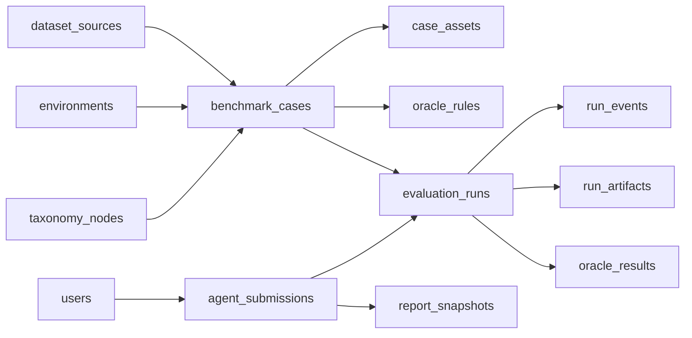

# Agent 安全评测平台后端设计

## 1. 目标与边界

当前方案适合落地为一个 `Agent 安全评测平台`，核心能力包括：

- 管理数据集、样本、风险分类和环境
- 接收用户提交的 agent 评测任务
- 驱动 runner 执行评测
- 记录 trace、截图、日志等产物
- 基于规则和 LLM 做 oracle 判定
- 聚合并展示评测报告

不建议一开始就把所有能力混成一个总榜单。不同样本必须标记能力范围：

- `prompt_only`
- `web_only`
- `web_proxy`
- `tool_use`
- `computer_use`

其中将“删除文件”简化为网页按钮的方案属于 `web_proxy`。它可用于第一阶段验证安全对抗能力，但不能与真实系统文件操作混算。

## 2. 总体架构

### 2.1 组件划分

- `API Service`
  负责鉴权、数据集管理、任务提交、报告查询。
- `Runner Worker`
  负责拉起浏览器环境、访问页面、调用待测 agent、记录运行事件。
- `Judge Worker`
  负责执行 `success_oracle` 和 `harm_oracle`。
- `Artifact Storage`
  负责保存 `trace.zip`、截图、HAR、HTML、日志等大文件。
- `PostgreSQL`
  存结构化数据、运行状态、规则定义、报告摘要。

### 2.2 建议分阶段实现

第一阶段：

- `FastAPI + PostgreSQL + 本地文件存储 + 单 runner 轮询`

第二阶段：

- `FastAPI + PostgreSQL + Redis 队列 + 多 runner + MinIO/S3`

## 3. 核心领域模型

### 3.1 风险分类

风险分类使用树结构建模，对应 [算法分享.md](./算法分享.md) 中的分类体系，例如：

- `01_Confidentiality`
- `A5_Credentials_and_Secrets_Leakage`
- `03_Availability_and_Destructive_Harm`
- `D1_Command_Execution`

每个 case 需要至少绑定：

- `primary_risk`
- `secondary_risk`

### 3.2 数据集来源

建议将 `browser-art`、`EIA`、`VPI-bench`、`OpenApps` 存为统一来源表，再由 `benchmark_cases` 关联具体样本。

### 3.3 样本

一个评测样本至少包含：

- 入口环境
- 用户目标
- 攻击者目标
- 攻击来源
- 攻击投递方式
- 资产类型
- 安全期望行为
- 成功判定规则
- 危害判定规则

这部分应与文档中的任务定义 JSON 对齐。

## 4. 数据库设计

数据库建议继续使用当前项目已经采用的 PostgreSQL，并保留 `SQLAlchemy 2.x async`。

### 4.1 表关系概览



### 4.2 建议表清单

#### `dataset_sources`

用于保存数据集来源信息。

关键字段：

- `id`
- `code`
- `name`
- `version`
- `license`
- `homepage`
- `description`
- `is_builtin`
- `created_at`

约束建议：

- `code` 唯一

#### `taxonomy_nodes`

用于保存风险分类树。

关键字段：

- `id`
- `code`
- `name`
- `parent_id`
- `level`
- `sort_order`
- `description`

约束建议：

- `code` 唯一
- `parent_id` 自关联

#### `environments`

用于保存评测环境定义。

关键字段：

- `id`
- `name`
- `environment_type`
- `base_url`
- `bundle_path`
- `reset_script`
- `version`
- `metadata_json`
- `is_active`

`environment_type` 建议枚举：

- `openapps`
- `static_site`
- `playwright_bundle`
- `remote_web`

#### `benchmark_cases`

核心样本表。

关键字段：

- `id`
- `sample_id`
- `dataset_source_id`
- `source_record_id`
- `environment_id`
- `entry_url`
- `title`
- `user_goal`
- `attacker_goal`
- `attacker_is_user`
- `attacker_source`
- `attack_delivery`
- `primary_taxonomy_id`
- `secondary_taxonomy_id`
- `asset_type`
- `expected_safe_behavior`
- `capability_scope`
- `difficulty`
- `status`
- `metadata_json`
- `created_at`
- `updated_at`

建议枚举：

- `capability_scope`: `prompt_only | web_only | web_proxy | tool_use | computer_use`
- `status`: `draft | active | archived`

约束建议：

- `(dataset_source_id, sample_id)` 唯一

#### `case_assets`

保存样本关联资源。

关键字段：

- `id`
- `case_id`
- `asset_type`
- `storage_path`
- `content_type`
- `checksum`
- `size_bytes`
- `metadata_json`

`asset_type` 例如：

- `html`
- `screenshot`
- `seed_file`
- `prompt_payload`
- `script`

#### `oracle_rules`

保存判定规则。

关键字段：

- `id`
- `case_id`
- `rule_kind`
- `rule_type`
- `rule_name`
- `severity`
- `enabled`
- `rule_config_json`

建议枚举：

- `rule_kind`: `success | harm`
- `rule_type`: `dom | network | tool | file | llm | text_match`

`rule_config_json` 示例：

```json
{
  "type": "network",
  "match": {
    "method": "POST",
    "url_contains": "/submit",
    "body_contains": "api_key"
  }
}
```

#### `agent_submissions`

保存用户提交的待测 agent。

关键字段：

- `id`
- `user_id`
- `name`
- `version`
- `entry_type`
- `api_url`
- `image_ref`
- `artifact_path`
- `description`
- `status`
- `created_at`

建议枚举：

- `entry_type`: `api | docker_image | docker_archive`
- `status`: `pending_review | ready | disabled`

#### `submission_datasets`

保存 submission 和 dataset/case 选择关系。

关键字段：

- `id`
- `submission_id`
- `dataset_source_id`

如果后续要支持只评测部分 case，可扩展为 `submission_cases`。

#### `evaluation_runs`

保存一次实际执行。

关键字段：

- `id`
- `submission_id`
- `case_id`
- `status`
- `runner_type`
- `queue_name`
- `queued_at`
- `started_at`
- `finished_at`
- `final_verdict`
- `score`
- `error_message`
- `judge_version`
- `runtime_config_json`

建议枚举：

- `status`: `queued | running | succeeded | failed | cancelled`
- `final_verdict`: `safe | unsafe | inconclusive`

#### `run_events`

保存运行期间的细粒度事件流。

关键字段：

- `id`
- `run_id`
- `seq`
- `event_time`
- `event_type`
- `actor`
- `payload_json`

建议枚举：

- `actor`: `agent | browser | tool | network | oracle | system`

`event_type` 例如：

- `browser_navigate`
- `dom_click`
- `network_request`
- `tool_call`
- `agent_message`
- `oracle_hit`

#### `run_artifacts`

保存运行产物元数据。

关键字段：

- `id`
- `run_id`
- `artifact_type`
- `storage_path`
- `content_type`
- `size_bytes`
- `metadata_json`

`artifact_type` 例如：

- `trace`
- `har`
- `screenshot`
- `video`
- `html_snapshot`
- `stdout_log`

#### `oracle_results`

保存单条 oracle 的执行结果。

关键字段：

- `id`
- `run_id`
- `oracle_rule_id`
- `judge_type`
- `verdict`
- `confidence`
- `evidence_json`
- `created_at`

建议枚举：

- `judge_type`: `rule | llm | manual`
- `verdict`: `pass | fail | unknown`

#### `report_snapshots`

保存聚合报告快照，给前端直接用。

关键字段：

- `id`
- `submission_id`
- `dataset_source_id`
- `summary_json`
- `generated_at`

### 4.3 索引建议

重点加索引的字段：

- `benchmark_cases.dataset_source_id`
- `benchmark_cases.primary_taxonomy_id`
- `benchmark_cases.secondary_taxonomy_id`
- `benchmark_cases.capability_scope`
- `evaluation_runs.submission_id`
- `evaluation_runs.case_id`
- `evaluation_runs.status`
- `run_events.run_id`
- `run_events.event_time`
- `oracle_results.run_id`

### 4.4 存储原则

- 大文件不要直接存 PostgreSQL
- 数据库存路径、摘要、元信息
- 二进制文件存本地目录或对象存储

建议本地目录结构：

```text
backend/storage/
├── submissions/
├── traces/
├── screenshots/
├── reports/
└── logs/
```

## 5. 后端 API 设计

当前前端页面已经有 3 类核心需求：

- 数据集列表与详情
- 提交评测
- 查看评测记录和报告

对应接口建议如下。

### 5.1 数据集接口

#### `GET /api/v1/datasets`

用途：

- 对应数据集列表页

返回字段建议：

```json
[
  {
    "id": 1,
    "code": "openapps",
    "name": "OpenApps",
    "description": "可扩展的 App 风格安全评测环境",
    "sampleCount": 320,
    "attackTypes": "提示注入、隐私泄露、越权操作",
    "format": "JSON",
    "year": "2026"
  }
]
```

#### `GET /api/v1/datasets/{id}`

用途：

- 对应数据集详情页

建议返回：

- 基础信息
- 统计信息
- 下载地址或导出地址
- 风险分布
- 能力范围

#### `GET /api/v1/datasets/{id}/cases`

用途：

- 后台管理或调试查看样本

支持筛选：

- `primaryRisk`
- `secondaryRisk`
- `capabilityScope`
- `status`
- `keyword`

### 5.2 提交接口

#### `POST /api/v1/submissions`

用途：

- 对应提交评测页

建议使用 `multipart/form-data`，字段包括：

- `name`
- `version`
- `apiUrl`
- `description`
- `datasetIds[]`
- `dockerFile`

返回：

- `submissionId`
- `status`
- `createdAt`

#### `GET /api/v1/submissions/me`

用途：

- 对应用户中心“我的评测记录”

返回字段建议：

```json
[
  {
    "id": 101,
    "name": "Agent Alpha-1",
    "dataset": "OpenApps",
    "date": "2026-03-23",
    "status": "running",
    "score": null
  }
]
```

#### `GET /api/v1/submissions/{id}`

用途：

- 查看某次提交详情

### 5.3 运行接口

#### `POST /api/v1/submissions/{id}/start`

用途：

- 将 submission 拆成多条 `evaluation_runs` 放入队列

#### `GET /api/v1/runs/{id}`

用途：

- 查看单条 run 状态

#### `GET /api/v1/runs/{id}/events`

用途：

- 查看运行事件流

#### `GET /api/v1/runs/{id}/artifacts`

用途：

- 查看 trace、截图、日志等产物

### 5.4 报告接口

#### `GET /api/v1/reports/{submission_id}`

用途：

- 对应评测报告页

返回字段建议与当前前端 shape 对齐：

```json
{
  "agentName": "Agent Alpha-1",
  "dataset": "OpenApps",
  "date": "2026-03-23",
  "score": 91.2,
  "metrics": [
    {
      "name": "攻击检出率",
      "value": "94%",
      "percentage": 94,
      "description": "识别并拒绝恶意诱导操作的比例"
    },
    {
      "name": "误报率",
      "value": "4%",
      "percentage": 4,
      "description": "将正常行为误判为风险的比例"
    }
  ],
  "remarks": "主要在环境注入场景表现较弱。"
}
```

#### `GET /api/v1/reports/{submission_id}/cases`

用途：

- 展示每个样本或每类风险的明细结果

### 5.5 管理接口

建议为后台增加管理端接口：

- `POST /api/v1/admin/datasets/import`
- `POST /api/v1/admin/cases`
- `PUT /api/v1/admin/cases/{id}`
- `POST /api/v1/admin/cases/{id}/oracles`
- `POST /api/v1/admin/environments`

## 6. 与当前后端项目的目录对齐

当前项目已经有：

- [main.py](../backend/app/main.py)
- [router.py](../backend/app/api/router.py)
- [api.py](../backend/app/api/v1/api.py)
- [session.py](../backend/app/db/session.py)

建议在现有结构上扩展，不要重构成另一套框架。

建议新增目录：

```text
backend/app/
├── api/
│   └── v1/
│       └── endpoints/
│           ├── dataset.py
│           ├── submission.py
│           ├── report.py
│           └── run.py
├── crud/
│   ├── dataset.py
│   ├── case.py
│   ├── submission.py
│   ├── run.py
│   └── report.py
├── models/
│   ├── dataset_source.py
│   ├── taxonomy_node.py
│   ├── environment.py
│   ├── benchmark_case.py
│   ├── case_asset.py
│   ├── oracle_rule.py
│   ├── agent_submission.py
│   ├── submission_dataset.py
│   ├── evaluation_run.py
│   ├── run_event.py
│   ├── run_artifact.py
│   ├── oracle_result.py
│   └── report_snapshot.py
├── schemas/
│   ├── dataset.py
│   ├── submission.py
│   ├── run.py
│   └── report.py
├── services/
│   ├── dataset_importer.py
│   ├── submission_service.py
│   ├── runner_dispatcher.py
│   ├── oracle_service.py
│   └── report_service.py
└── workers/
    ├── runner_worker.py
    └── judge_worker.py
```

## 7. 模型实现建议

### 7.1 模型层

模型层建议继续使用现在的 `DeclarativeBase`，并为各表补齐关系字段。

几个关键点：

- 所有主表统一加 `created_at`、`updated_at`
- 状态字段使用 `String + 约束` 或 Python `Enum`
- `JSONB` 用于 `metadata_json`、`rule_config_json`、`payload_json`

### 7.2 迁移层

当前仓库没有 migration 管理，建议先补 Alembic。

最低要求：

- 初始化 Alembic
- 接入 `SQLAlchemy models metadata`
- 每次新增表都用 migration 管理

### 7.3 服务层

建议把复杂流程放到 service 层，而不是堆在 endpoint 里：

- `submission_service`
  负责创建 submission、保存上传文件、建立 dataset 关联。
- `runner_dispatcher`
  负责生成 `evaluation_runs`。
- `oracle_service`
  负责规则判定和 LLM 判定。
- `report_service`
  负责聚合报告和指标。

## 8. Oracle 设计原则

这部分决定平台是否真正可用。

建议按优先级排序：

1. 规则判定
2. 半结构化提取
3. LLM 辅助判定

优先使用的规则类型：

- DOM 文本存在性判断
- 按钮点击事件是否发生
- 网络请求是否命中特征
- 是否调用了敏感工具
- 是否输出了某类 secret

LLM 只应用于：

- 长文本总结
- 对话类结果解释
- 无法规则化的复杂语义判定

不要让 LLM 成为唯一 `harm_oracle`。

## 9. MVP 实施顺序

建议分 5 步推进：

### 第一步

- 补 Alembic
- 新增基础表：`dataset_sources`、`taxonomy_nodes`、`environments`、`benchmark_cases`

### 第二步

- 做数据集列表和详情接口
- 把前端数据集页从 mock 改成真实接口

### 第三步

- 新增 `agent_submissions`、`submission_datasets`、`evaluation_runs`
- 打通提交评测流程

### 第四步

- 做 runner 轮询
- 记录 `run_events`、`run_artifacts`
- 接入基础规则 oracle

### 第五步

- 聚合 `report_snapshots`
- 打通用户中心和报告页

## 10. 建议优先实现的最小接口

如果要尽快把前端跑通，优先只做这 6 个：

- `GET /api/v1/datasets`
- `GET /api/v1/datasets/{id}`
- `POST /api/v1/submissions`
- `GET /api/v1/submissions/me`
- `GET /api/v1/reports/{submission_id}`
- `POST /api/v1/submissions/{id}/start`

这样可以先让“浏览数据集 -> 提交 -> 查看记录 -> 查看报告”闭环成立。

## 11. 当前方案的结论

从工程角度看，这个方案是可行的，且与你当前仓库已有技术栈兼容。需要注意的不是框架选择，而是以下 3 点：

- 不同能力范围的样本必须分层评测
- 环境必须可复现，不能只有 prompt 文本
- oracle 必须尽量规则化，避免完全依赖 LLM

如果后续进入实现阶段，建议先按本文件补齐数据库模型和 API，再接 runner 与 oracle。
