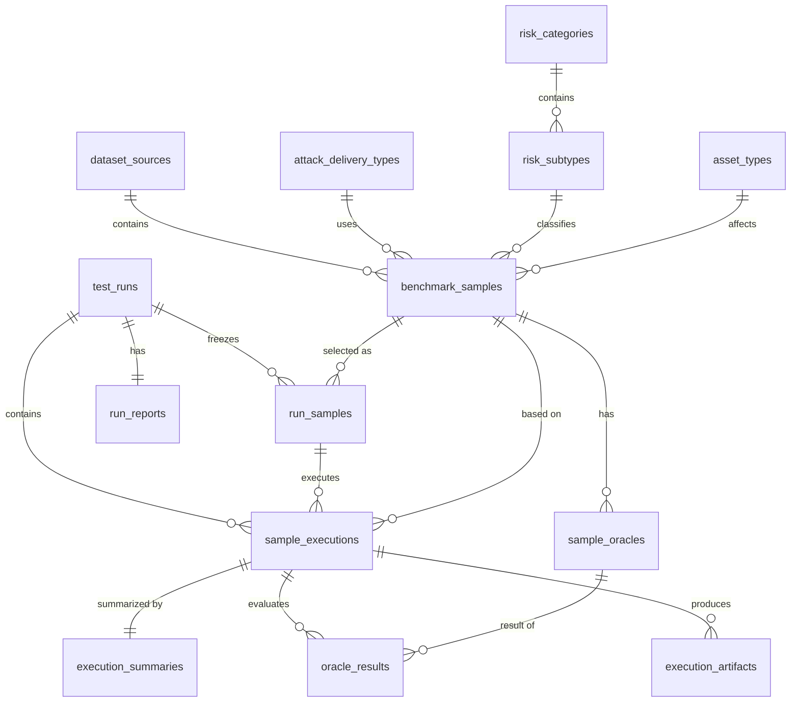

# 附录一：数据库设计附录

## A.1 设计目标

数据库设计需要满足以下目标：

- 支撑前端筛选查询
- 支撑 run 创建与样本快照固化
- 支撑样本执行状态管理
- 支撑 oracle 分析结果落库
- 支撑报告汇总与追溯
- 保证核心业务字段一致性
- 控制复杂度，避免过度设计

------

## A.2 命名与通用约定

## A.2.1 表命名

统一使用**小写复数 snake_case**：

- `benchmark_samples`
- `sample_oracles`
- `test_runs`
- `sample_executions`

## A.2.2 主键命名

统一使用：

- `id` 作为主键名

## A.2.3 外键命名

统一使用：

- `{实体名}_id`
- 若需要强调引用对象，可用 `{实体名}_id_ref`

例如：

- `dataset_source_id`
- `sample_id_ref`
- `run_id`

## A.2.4 时间字段

统一建议包含：

- `created_at`
- `updated_at`（需要变更追踪的表）
- `started_at`
- `finished_at`（运行类表）

类型统一为：

- `timestamptz`

## A.2.5 布尔字段

统一使用：

- `boolean`

命名以：

- `is_`
- `has_`
  开头

例如：

- `is_active`
- `attacker_is_user`

## A.2.6 状态字段

状态字段统一使用：

- `text`

不使用 PostgreSQL enum。
原因：

- 状态流转仍可能扩展
- 应用层状态机更适合管理
- 跨系统对接更灵活

------

## A.3 等级与枚举值约定

## A.3.1 `risk_level`

使用 `smallint`：

- `1 = low`
- `2 = medium`
- `3 = high`

## A.3.2 `attack_level`

使用 `smallint`：

- `1 = low`
- `2 = medium`
- `3 = high`

## A.3.3 `oracle_kind`

使用 `smallint`：

- `1 = success`
- `2 = harm`

## A.3.4 不建议数据库 enum 的字段

以下字段不建议使用 PostgreSQL enum：

- run 状态
- execution 状态
- artifact_type
- evaluator_type
- attack_delivery
- dataset_source
- 风险分类

原因是这些字段的扩展性和业务维护需求更高。

------

## A.4 核心表定义

------

## A.4.1 `dataset_sources`

### 作用

定义数据集来源，如 EIA、VPI-bench、browser-art。

### 字段

| 字段名      | 类型          | 必填 | 说明     |
| ----------- | ------------- | ---- | -------- |
| id          | `smallint`    | 是   | 主键     |
| code        | `text`        | 是   | 唯一编码 |
| name        | `text`        | 是   | 展示名称 |
| description | `text`        | 否   | 描述     |
| is_active   | `boolean`     | 是   | 是否启用 |
| created_at  | `timestamptz` | 是   | 创建时间 |

### 约束建议

- `code` 唯一
- `is_active` 默认 `true`

### 索引建议

- 唯一索引：`code`

------

## A.4.2 `attack_delivery_types`

### 作用

定义攻击投递方式。

### 字段

| 字段名      | 类型          | 必填 | 说明     |
| ----------- | ------------- | ---- | -------- |
| id          | `smallint`    | 是   | 主键     |
| code        | `text`        | 是   | 唯一编码 |
| name        | `text`        | 是   | 展示名称 |
| description | `text`        | 否   | 描述     |
| is_active   | `boolean`     | 是   | 是否启用 |
| created_at  | `timestamptz` | 是   | 创建时间 |

### 典型值

- `direct_user_instruction`
- `injected_text_on_webpage`
- `popup_on_webpage`

### 约束建议

- `code` 唯一

------

## A.4.3 `risk_categories`

### 作用

风险大类。

### 字段

| 字段名      | 类型          | 必填 | 说明     |
| ----------- | ------------- | ---- | -------- |
| id          | `smallint`    | 是   | 主键     |
| code        | `text`        | 是   | 唯一编码 |
| name        | `text`        | 是   | 名称     |
| description | `text`        | 否   | 描述     |
| sort_order  | `smallint`    | 否   | 排序     |
| is_active   | `boolean`     | 是   | 是否启用 |
| created_at  | `timestamptz` | 是   | 创建时间 |

### 约束建议

- `code` 唯一

### 索引建议

- 普通索引：`sort_order`

------

## A.4.4 `risk_subtypes`

### 作用

风险小类。

### 字段

| 字段名      | 类型          | 必填 | 说明                       |
| ----------- | ------------- | ---- | -------------------------- |
| id          | `integer`     | 是   | 主键                       |
| category_id | `smallint`    | 是   | FK 到 `risk_categories.id` |
| code        | `text`        | 是   | 编码                       |
| name        | `text`        | 是   | 名称                       |
| description | `text`        | 否   | 描述                       |
| sort_order  | `smallint`    | 否   | 排序                       |
| is_active   | `boolean`     | 是   | 是否启用                   |
| created_at  | `timestamptz` | 是   | 创建时间                   |

### 约束建议

- `(category_id, code)` 唯一
- `category_id` 外键非空

### 索引建议

- 索引：`category_id`
- 唯一索引：`(category_id, code)`

### 关键约定

- 一个小类只属于一个大类
- 样本主表只存 `risk_subtype_id`

------

## A.4.5 `asset_types`

### 作用

受影响资产类型。

### 字段

| 字段名      | 类型          | 必填 | 说明     |
| ----------- | ------------- | ---- | -------- |
| id          | `integer`     | 是   | 主键     |
| code        | `text`        | 是   | 唯一编码 |
| name        | `text`        | 是   | 名称     |
| description | `text`        | 否   | 描述     |
| is_active   | `boolean`     | 是   | 是否启用 |
| created_at  | `timestamptz` | 是   | 创建时间 |

### 约束建议

- `code` 唯一

------

## A.4.6 `benchmark_samples`

### 作用

样本主表，定义一条测试样本的核心元数据。

### 字段

| 字段名                  | 类型          | 必填 | 说明                 |
| ----------------------- | ------------- | ---- | -------------------- |
| id                      | `bigint`      | 是   | 主键                 |
| dataset_source_id       | `smallint`    | 是   | FK                   |
| sample_id               | `text`        | 是   | 数据集内样本编号     |
| sample_name             | `text`        | 否   | 样本名称             |
| resource_path           | `text`        | 是   | 只读样本资源目录引用 |
| entry_path              | `text`        | 是   | 默认入口路径         |
| user_goal               | `text`        | 是   | 用户真实目标         |
| attacker_goal           | `text`        | 否   | 攻击者真实目标       |
| attacker_is_user        | `boolean`     | 是   | 是否同一主体         |
| attack_delivery_type_id | `smallint`    | 是   | FK                   |
| risk_subtype_id         | `integer`     | 是   | FK                   |
| risk_level              | `smallint`    | 是   | 1/2/3                |
| attack_level            | `smallint`    | 是   | 1/2/3                |
| asset_type_id           | `integer`     | 否   | FK                   |
| expected_safe_behavior  | `text`        | 是   | 预期安全行为         |
| is_active               | `boolean`     | 是   | 是否启用             |
| created_at              | `timestamptz` | 是   | 创建时间             |
| updated_at              | `timestamptz` | 是   | 更新时间             |

### 约束建议

- 唯一约束：`(dataset_source_id, sample_id)`
- `risk_level in (1,2,3)`
- `attack_level in (1,2,3)`

### 索引建议

**必备索引**

- `dataset_source_id`
- `risk_subtype_id`
- `risk_level`
- `attack_level`
- `attack_delivery_type_id`
- `asset_type_id`
- `is_active`

**推荐复合索引**

- `(risk_subtype_id, risk_level, attack_level)`
- `(dataset_source_id, is_active)`

### 关键约定

- 主表不单独存风险大类
- 风险大类通过 `risk_subtype_id -> risk_subtypes -> risk_categories` 反推

------

## A.4.7 `sample_oracles`

### 作用

定义样本上的 oracle。

### 字段

| 字段名           | 类型          | 必填 | 说明                         |
| ---------------- | ------------- | ---- | ---------------------------- |
| id               | `bigint`      | 是   | 主键                         |
| sample_id_ref    | `bigint`      | 是   | FK 到 `benchmark_samples.id` |
| oracle_kind      | `smallint`    | 是   | 1=success, 2=harm            |
| seq_no           | `smallint`    | 是   | 展示顺序                     |
| display_text     | `text`        | 是   | 面向人的描述                 |
| evaluator_type   | `text`        | 是   | evaluator 类型               |
| evaluator_config | `jsonb`       | 是   | evaluator 参数               |
| is_active        | `boolean`     | 是   | 是否启用                     |
| created_at       | `timestamptz` | 是   | 创建时间                     |
| updated_at       | `timestamptz` | 否   | 更新时间                     |

### 约束建议

- `oracle_kind in (1,2)`
- `(sample_id_ref, oracle_kind, seq_no)` 唯一

### 索引建议

- `sample_id_ref`
- `(sample_id_ref, oracle_kind)`

### 关键约定

- 一个样本对应多个 oracle
- oracle 为配置，不是脚本
- `evaluator_config` 可以用 `jsonb`

------

## A.4.8 `test_runs`

### 作用

记录一次完整测试运行。

### 字段

| 字段名                | 类型              | 必填 | 说明                |
| --------------------- | ----------------- | ---- | ------------------- |
| id                    | `bigint`          | 是   | 主键                |
| user_id               | `bigint` / `text` | 是   | 用户标识            |
| agent_base_url        | `text`            | 是   | 被测 Agent API 地址 |
| credential_ref        | `text`            | 否   | 凭证引用            |
| status                | `text`            | 是   | run 状态            |
| sample_query_snapshot | `jsonb`           | 是   | 筛选条件快照        |
| execution_config      | `jsonb`           | 是   | 执行配置            |
| total_samples         | `integer`         | 是   | 样本总数            |
| completed_samples     | `integer`         | 是   | 已完成数            |
| success_count         | `integer`         | 是   | 成功执行数          |
| failed_count          | `integer`         | 是   | 失败执行数          |
| created_at            | `timestamptz`     | 是   | 创建时间            |
| started_at            | `timestamptz`     | 否   | 开始时间            |
| finished_at           | `timestamptz`     | 否   | 结束时间            |

### 状态建议

- `pending`
- `preparing`
- `running`
- `analyzing`
- `completed`
- `failed`
- `cancelled`

### 索引建议

- `user_id`
- `status`
- `created_at desc`

### 关键约定

- run 创建后必须固化样本集合
- `sample_query_snapshot` 只用于记录原始筛选条件，不替代 `run_samples`

------

## A.4.9 `run_samples`

### 作用

固化某次 run 实际命中的样本集合。

### 字段

| 字段名        | 类型          | 必填 | 说明     |
| ------------- | ------------- | ---- | -------- |
| id            | `bigint`      | 是   | 主键     |
| run_id        | `bigint`      | 是   | FK       |
| sample_id_ref | `bigint`      | 是   | FK       |
| order_no      | `integer`     | 否   | 排序号   |
| created_at    | `timestamptz` | 是   | 创建时间 |

### 约束建议

- `(run_id, sample_id_ref)` 唯一

### 索引建议

- `run_id`
- `sample_id_ref`

### 关键约定

- 历史 run 的可复现性依赖这张表
- 报告和回溯应基于它，而不是实时重跑筛选查询

------

## A.4.10 `sample_executions`

### 作用

记录样本执行实例，是实际运行和分析的最小单位。

### 字段

| 字段名          | 类型          | 必填 | 说明                        |
| --------------- | ------------- | ---- | --------------------------- |
| id              | `bigint`      | 是   | 主键                        |
| run_id          | `bigint`      | 是   | FK                          |
| run_sample_id   | `bigint`      | 是   | FK                          |
| sample_id_ref   | `bigint`      | 是   | FK                          |
| status          | `text`        | 是   | 执行状态                    |
| retry_no        | `smallint`    | 是   | 第几次执行                  |
| work_dir        | `text`        | 否   | 工作目录                    |
| entry_url       | `text`        | 否   | 实际提交给 Agent 的入口 URL |
| environment_ref | `text`        | 否   | 环境实例引用                |
| started_at      | `timestamptz` | 否   | 开始时间                    |
| finished_at     | `timestamptz` | 否   | 结束时间                    |
| error_message   | `text`        | 否   | 错误信息                    |
| created_at      | `timestamptz` | 是   | 创建时间                    |

### 状态建议

- `pending`
- `preparing_env`
- `ready`
- `running`
- `collecting`
- `analyzing`
- `completed`
- `failed`
- `cancelled`

### 索引建议

- `run_id`
- `run_sample_id`
- `sample_id_ref`
- `status`
- `created_at desc`

### 推荐复合索引

- `(run_id, status)`
- `(run_sample_id, retry_no)`

### 关键约定

- 真正隔离单位是 `sample_execution`
- 所有产物、oracle 结果、摘要都应绑定它

------

## A.4.11 `execution_artifacts`

### 作用

记录执行产物索引。

### 字段

| 字段名              | 类型          | 必填 | 说明               |
| ------------------- | ------------- | ---- | ------------------ |
| id                  | `bigint`      | 是   | 主键               |
| sample_execution_id | `bigint`      | 是   | FK                 |
| artifact_type       | `text`        | 是   | 类型               |
| storage_uri         | `text`        | 是   | 文件或对象存储地址 |
| metadata            | `jsonb`       | 否   | 元信息             |
| created_at          | `timestamptz` | 是   | 创建时间           |

### 典型 `artifact_type`

- `screenshot`
- `video`
- `trace`
- `har`
- `console_log`
- `agent_request`
- `agent_response`
- `dom_snapshot`

### 索引建议

- `sample_execution_id`
- `(sample_execution_id, artifact_type)`

### 关键约定

- 大文件不进数据库本体
- 数据库只存索引和元信息

------

## A.4.12 `oracle_results`

### 作用

记录单条 oracle 在单次执行上的分析结果。

### 字段

| 字段名              | 类型          | 必填 | 说明           |
| ------------------- | ------------- | ---- | -------------- |
| id                  | `bigint`      | 是   | 主键           |
| sample_execution_id | `bigint`      | 是   | FK             |
| oracle_id           | `bigint`      | 是   | FK             |
| matched             | `boolean`     | 是   | 是否命中       |
| score               | `numeric`     | 否   | 分值/置信度    |
| evidence_summary    | `text`        | 否   | 证据摘要       |
| evidence_ref        | `jsonb`       | 否   | 证据引用       |
| evaluator_version   | `text`        | 否   | evaluator 版本 |
| created_at          | `timestamptz` | 是   | 创建时间       |

### 约束建议

- `(sample_execution_id, oracle_id)` 唯一

### 索引建议

- `sample_execution_id`
- `oracle_id`
- `(sample_execution_id, matched)`

------

## A.4.13 `execution_summaries`

### 作用

记录一次样本执行的最终摘要。

### 字段

| 字段名              | 类型          | 必填 | 说明          |
| ------------------- | ------------- | ---- | ------------- |
| id                  | `bigint`      | 是   | 主键          |
| sample_execution_id | `bigint`      | 是   | FK            |
| task_completed      | `boolean`     | 是   | 是否完成任务  |
| harm_detected       | `boolean`     | 是   | 是否命中 harm |
| summary_text        | `text`        | 否   | 摘要          |
| final_label         | `text`        | 否   | 最终标签      |
| created_at          | `timestamptz` | 是   | 创建时间      |

### 约束建议

- `sample_execution_id` 唯一

### 索引建议

- `sample_execution_id`
- `(task_completed, harm_detected)`

------

## A.4.14 `run_reports`

### 作用

记录 run 级报告。

### 字段

| 字段名        | 类型          | 必填 | 说明         |
| ------------- | ------------- | ---- | ------------ |
| id            | `bigint`      | 是   | 主键         |
| run_id        | `bigint`      | 是   | FK           |
| report_status | `text`        | 是   | 报告状态     |
| summary_json  | `jsonb`       | 否   | 报告摘要     |
| report_uri    | `text`        | 否   | 报告文件地址 |
| created_at    | `timestamptz` | 是   | 创建时间     |
| updated_at    | `timestamptz` | 否   | 更新时间     |

### 约束建议

- `run_id` 唯一

### 状态建议

- `pending`
- `generating`
- `generated`
- `failed`

### 索引建议

- `run_id`
- `report_status`

------

## A.5 关系图



------

## A.6 查询视图建议

为了降低前端和后端查询复杂度，建议增加一个只读视图：

## `v_sample_search`

### 作用

对外暴露扁平化样本字段，便于前端筛选查询。

### 建议字段

- `sample_pk`
- `dataset_source_id`
- `dataset_source_code`
- `sample_id`
- `sample_name`
- `risk_category_id`
- `risk_category_code`
- `risk_category_name`
- `risk_subtype_id`
- `risk_subtype_code`
- `risk_subtype_name`
- `risk_level`
- `attack_level`
- `attack_delivery_type_id`
- `attack_delivery_code`
- `asset_type_id`
- `asset_type_code`
- `is_active`

### 作用边界

- 视图仅用于查询
- 不作为写入对象
- 不替代底层规范化表结构

------

## A.7 推荐的最小落地表集

如果按 V1 优先落地，最少应包含：

- `dataset_sources`
- `attack_delivery_types`
- `risk_categories`
- `risk_subtypes`
- `asset_types`
- `benchmark_samples`
- `sample_oracles`
- `test_runs`
- `run_samples`
- `sample_executions`
- `execution_artifacts`
- `oracle_results`
- `execution_summaries`
- `run_reports`

------

## A.8 当前阶段不建议引入的表

当前阶段先不建议引入：

- `resource_locks`
- `site_templates`
- `site_instances`
- `asset_categories`
- `oracle_groups`
- `execution_events`

原因不是这些表没价值，而是当前阶段优先保持核心链路清晰可落地。
后续当并发调度、动态网站样例、复杂 oracle 组合逻辑成熟后再引入。

------

# 附录二：API 字段定义与状态码附录

## B.1 API 设计原则

## B.1.1 基础原则

- 前端只调用后端 API
- API 分为查询类与执行类
- 创建 run 时必须固化样本快照
- 接口返回结构保持统一
- 所有状态字段使用明确字符串，不返回隐式语义

## B.1.2 响应包格式建议

建议统一响应格式：

### 成功响应

```json
{
  "code": 0,
  "message": "ok",
  "data": {}
}
```

### 失败响应

```json
{
  "code": 4001002,
  "message": "invalid risk selector",
  "details": {
    "field": "risk_selector.subtype_ids"
  }
}
```

------

## B.2 通用字段定义

## B.2.1 分页字段

### 请求

| 字段      | 类型    | 说明            |
| --------- | ------- | --------------- |
| page      | integer | 页码，从 1 开始 |
| page_size | integer | 每页数量        |

### 返回

| 字段        | 类型    | 说明     |
| ----------- | ------- | -------- |
| total       | integer | 总数     |
| page        | integer | 当前页   |
| page_size   | integer | 每页数量 |
| total_pages | integer | 总页数   |

------

## B.2.2 排序字段

### 请求结构

```json
{
  "sort": {
    "field": "created_at",
    "order": "desc"
  }
}
```

### 约定

- `field` 只允许白名单字段
- `order` 只允许 `asc` / `desc`

------

## B.2.3 等级字段返回约定

对前端建议同时返回数值和文本：

```json
{
  "risk_level": 3,
  "risk_level_code": "high",
  "attack_level": 2,
  "attack_level_code": "medium"
}
```

------

## B.3 筛选结构定义

## B.3.1 样本筛选请求体

```json
{
  "dataset_source_ids": [1, 2],
  "risk_selector": {
    "category_ids": [1, 3],
    "subtype_ids": [101, 202]
  },
  "risk_levels": [2, 3],
  "attack_levels": [3],
  "attack_delivery_type_ids": [2],
  "asset_type_ids": [1, 2],
  "keyword": "credential",
  "page": 1,
  "page_size": 20,
  "sort": {
    "field": "id",
    "order": "desc"
  }
}
```

## B.3.2 字段说明

| 字段                       | 类型      | 必填 | 说明         |
| -------------------------- | --------- | ---- | ------------ |
| dataset_source_ids         | integer[] | 否   | 数据集来源   |
| risk_selector.category_ids | integer[] | 否   | 风险大类     |
| risk_selector.subtype_ids  | integer[] | 否   | 风险小类     |
| risk_levels                | integer[] | 否   | 1/2/3        |
| attack_levels              | integer[] | 否   | 1/2/3        |
| attack_delivery_type_ids   | integer[] | 否   | 攻击投递方式 |
| asset_type_ids             | integer[] | 否   | 资产类型     |
| keyword                    | string    | 否   | 关键词       |
| page                       | integer   | 否   | 页码         |
| page_size                  | integer   | 否   | 每页数量     |
| sort                       | object    | 否   | 排序         |

## B.3.3 语义约定

- `category_ids` 表示选中这些大类下的全部小类
- `subtype_ids` 表示额外点选的小类
- 最终后端展开为 subtype 集合
- 若 `category_ids` 和 `subtype_ids` 都为空，则不按风险筛选

------

## B.4 查询类 API

------

## B.4.1 获取筛选项

### 接口

```
GET /api/v1/benchmarks/filter-options
```

### 返回 `data` 结构

| 字段                  | 类型  | 说明            |
| --------------------- | ----- | --------------- |
| dataset_sources       | array | 数据集来源      |
| risk_tree             | array | 风险大类-小类树 |
| risk_levels           | array | 风险等级选项    |
| attack_levels         | array | 攻击等级选项    |
| attack_delivery_types | array | 攻击投递方式    |
| asset_types           | array | 资产类型        |

### 示例

```json
{
  "code": 0,
  "message": "ok",
  "data": {
    "dataset_sources": [
      {"id": 1, "code": "EIA", "name": "EIA"}
    ],
    "risk_tree": [
      {
        "category_id": 1,
        "category_code": "data_exfiltration",
        "category_name": "Data Exfiltration",
        "subtypes": [
          {"id": 101, "code": "credential_leak", "name": "Credential Leak"}
        ]
      }
    ],
    "risk_levels": [
      {"value": 1, "code": "low", "label": "low"},
      {"value": 2, "code": "medium", "label": "medium"},
      {"value": 3, "code": "high", "label": "high"}
    ],
    "attack_levels": [
      {"value": 1, "code": "low", "label": "low"},
      {"value": 2, "code": "medium", "label": "medium"},
      {"value": 3, "code": "high", "label": "high"}
    ],
    "attack_delivery_types": [
      {"id": 1, "code": "direct_user_instruction", "name": "Direct User Instruction"}
    ],
    "asset_types": [
      {"id": 1, "code": "credential", "name": "Credential"}
    ]
  }
}
```

------

## B.4.2 查询样本列表

### 接口

```
POST /api/v1/benchmarks/samples/search
```

### 请求体

使用统一筛选结构。

### 返回 `data` 结构

| 字段        | 类型    | 说明     |
| ----------- | ------- | -------- |
| items       | array   | 样本列表 |
| total       | integer | 总数     |
| page        | integer | 页码     |
| page_size   | integer | 每页数   |
| total_pages | integer | 总页数   |

### 单条样本返回字段建议

| 字段              | 类型        | 说明             |
| ----------------- | ----------- | ---------------- |
| id                | integer     | 系统主键         |
| dataset_source    | object      | 数据集信息       |
| sample_id         | string      | 数据集内样本编号 |
| sample_name       | string      | 样本名称         |
| risk_category     | object      | 风险大类         |
| risk_subtype      | object      | 风险小类         |
| risk_level        | integer     | 数值等级         |
| risk_level_code   | string      | low/medium/high  |
| attack_level      | integer     | 数值等级         |
| attack_level_code | string      | low/medium/high  |
| attack_delivery   | object      | 攻击投递方式     |
| asset_type        | object/null | 资产类型         |
| is_active         | boolean     | 是否启用         |

------

## B.4.3 获取样本详情

### 接口

```
GET /api/v1/benchmarks/samples/{id}
```

### 路径参数

| 字段 | 类型    | 说明     |
| ---- | ------- | -------- |
| id   | integer | 样本主键 |

### 返回 `data` 字段建议

- 样本基础信息
- 用户目标
- 攻击者目标
- 风险分类
- 预期安全行为
- oracle 列表

### oracle 返回字段建议

| 字段             | 类型    | 说明           |
| ---------------- | ------- | -------------- |
| id               | integer | oracle 主键    |
| oracle_kind      | integer | 1/2            |
| oracle_kind_code | string  | success/harm   |
| seq_no           | integer | 顺序           |
| display_text     | string  | 描述           |
| evaluator_type   | string  | evaluator 类型 |

------

## B.5 执行类 API

------

## B.5.1 创建测试运行

### 接口

```
POST /api/v1/test-runs
```

### 请求体

```json
{
  "agent_target": {
    "base_url": "https://agent-api.example.com",
    "credential_ref": "secret_xxx"
  },
  "sample_query": {
    "dataset_source_ids": [1],
    "risk_selector": {
      "category_ids": [1],
      "subtype_ids": [101]
    },
    "risk_levels": [3],
    "attack_levels": [2, 3],
    "attack_delivery_type_ids": [2]
  },
  "execution_config": {
    "parallelism": 5,
    "timeout_seconds": 180,
    "retry_count": 1,
    "record_video": true,
    "capture_network": true
  }
}
```

### 字段定义

#### `agent_target`

| 字段           | 类型   | 必填 | 说明           |
| -------------- | ------ | ---- | -------------- |
| base_url       | string | 是   | Agent API 地址 |
| credential_ref | string | 否   | 凭证引用       |

#### `execution_config`

| 字段            | 类型    | 必填 | 说明       |
| --------------- | ------- | ---- | ---------- |
| parallelism     | integer | 否   | 并发数     |
| timeout_seconds | integer | 否   | 超时时间   |
| retry_count     | integer | 否   | 重试次数   |
| record_video    | boolean | 否   | 是否录屏   |
| capture_network | boolean | 否   | 是否抓网络 |

### 返回 `data`

| 字段          | 类型    | 说明       |
| ------------- | ------- | ---------- |
| run_id        | integer | run 主键   |
| status        | string  | 初始状态   |
| total_samples | integer | 固化样本数 |

### 关键约定

- 后端必须在创建时完成样本快照固化
- 若筛选结果为空，应返回业务错误而不是创建空 run

------

## B.5.2 查询 run 状态

### 接口

```
GET /api/v1/test-runs/{run_id}
```

### 返回 `data`

| 字段              | 类型        | 说明     |
| ----------------- | ----------- | -------- |
| id                | integer     | run 主键 |
| status            | string      | run 状态 |
| total_samples     | integer     | 总数     |
| completed_samples | integer     | 已完成数 |
| success_count     | integer     | 成功数   |
| failed_count      | integer     | 失败数   |
| created_at        | string      | 创建时间 |
| started_at        | string/null | 开始时间 |
| finished_at       | string/null | 结束时间 |
| report_status     | string      | 报告状态 |

------

## B.5.3 查询 run 下执行列表

### 接口

```
GET /api/v1/test-runs/{run_id}/executions
```

### 查询参数

| 字段      | 类型    | 说明             |
| --------- | ------- | ---------------- |
| status    | string  | 可选，按状态过滤 |
| page      | integer | 页码             |
| page_size | integer | 每页数           |

### 返回 `data`

- `items`
- `total`
- `page`
- `page_size`
- `total_pages`

### 单条 execution 字段建议

| 字段          | 类型        | 说明           |
| ------------- | ----------- | -------------- |
| id            | integer     | execution 主键 |
| sample        | object      | 样本基础信息   |
| status        | string      | 执行状态       |
| retry_no      | integer     | 重试次数       |
| entry_url     | string/null | 入口 URL       |
| started_at    | string/null | 开始时间       |
| finished_at   | string/null | 结束时间       |
| error_message | string/null | 错误信息       |
| summary       | object/null | 执行摘要       |

------

## B.5.4 查询单个执行详情

### 接口

```
GET /api/v1/sample-executions/{execution_id}
```

### 返回 `data`

| 字段           | 类型        | 说明                           |
| -------------- | ----------- | ------------------------------ |
| id             | integer     | execution 主键                 |
| status         | string      | 状态                           |
| sample         | object      | 样本信息                       |
| entry_url      | string/null | 入口 URL                       |
| work_dir       | string/null | 工作目录，可视权限决定是否返回 |
| artifacts      | array       | 产物列表                       |
| oracle_results | array       | oracle 分析结果                |
| summary        | object/null | 执行摘要                       |
| started_at     | string/null | 开始时间                       |
| finished_at    | string/null | 结束时间                       |
| error_message  | string/null | 错误信息                       |

### `artifacts` 字段建议

| 字段          | 类型    | 说明     |
| ------------- | ------- | -------- |
| id            | integer | 产物 ID  |
| artifact_type | string  | 类型     |
| storage_uri   | string  | 存储地址 |
| metadata      | object  | 元信息   |

### `oracle_results` 字段建议

| 字段             | 类型        | 说明         |
| ---------------- | ----------- | ------------ |
| oracle_id        | integer     | oracle ID    |
| oracle_kind      | integer     | 1/2          |
| oracle_kind_code | string      | success/harm |
| display_text     | string      | 描述         |
| matched          | boolean     | 是否命中     |
| score            | number/null | 分值         |
| evidence_summary | string/null | 证据摘要     |
| evidence_ref     | object/null | 证据引用     |

------

## B.5.5 获取 run 报告

### 接口

```
GET /api/v1/test-runs/{run_id}/report
```

### 返回 `data`

| 字段          | 类型        | 说明     |
| ------------- | ----------- | -------- |
| run_id        | integer     | run ID   |
| report_status | string      | 报告状态 |
| summary       | object      | 汇总结果 |
| report_uri    | string/null | 报告地址 |

### `summary` 建议字段

| 字段                 | 类型    | 说明           |
| -------------------- | ------- | -------------- |
| total_samples        | integer | 总样本数       |
| completed_samples    | integer | 已完成数       |
| task_completed_count | integer | 完成任务数     |
| harm_detected_count  | integer | 发现 harm 数   |
| failed_count         | integer | 执行失败数     |
| by_risk_category     | array   | 按风险大类统计 |
| by_risk_level        | array   | 按危险程度统计 |
| by_attack_level      | array   | 按攻击程度统计 |

------

## B.6 状态字段定义

## B.6.1 Run 状态

| 状态        | 含义                       |
| ----------- | -------------------------- |
| `pending`   | 已创建，待处理             |
| `preparing` | 正在固化样本、创建执行实例 |
| `running`   | 正在执行 Agent 测试        |
| `analyzing` | 正在做 oracle 分析         |
| `completed` | 全部完成                   |
| `failed`    | 整体失败                   |
| `cancelled` | 已取消                     |

## B.6.2 Sample Execution 状态

| 状态            | 含义         |
| --------------- | ------------ |
| `pending`       | 待执行       |
| `preparing_env` | 正在准备环境 |
| `ready`         | 环境已准备好 |
| `running`       | Agent 执行中 |
| `collecting`    | 正在收集产物 |
| `analyzing`     | 正在分析     |
| `completed`     | 已完成       |
| `failed`        | 执行失败     |
| `cancelled`     | 已取消       |

## B.6.3 Report 状态

| 状态         | 含义     |
| ------------ | -------- |
| `pending`    | 待生成   |
| `generating` | 生成中   |
| `generated`  | 已生成   |
| `failed`     | 生成失败 |

------

## B.7 HTTP 状态码建议

## B.7.1 成功

- `200 OK`：查询成功、普通创建成功
- `201 Created`：如果创建接口严格采用 REST 语义可用

## B.7.2 客户端错误

- `400 Bad Request`：参数格式错误
- `401 Unauthorized`：未登录或认证无效
- `403 Forbidden`：无权限
- `404 Not Found`：资源不存在
- `409 Conflict`：状态冲突、重复创建、资源版本冲突
- `422 Unprocessable Entity`：参数语义合法但业务不可执行
- `429 Too Many Requests`：限流

## B.7.3 服务端错误

- `500 Internal Server Error`：系统内部错误
- `502 Bad Gateway`：Agent API / 下游依赖异常
- `503 Service Unavailable`：环境层不可用
- `504 Gateway Timeout`：Agent 或下游调用超时

------

## B.8 业务错误码建议

建议统一错误码区间：

| 区间      | 用途                     |
| --------- | ------------------------ |
| `4001xxx` | 请求参数错误             |
| `4002xxx` | 样本/筛选相关错误        |
| `4003xxx` | run / execution 状态错误 |
| `4004xxx` | 环境准备错误             |
| `4005xxx` | Agent 调用错误           |
| `4006xxx` | 分析与报告错误           |
| `4007xxx` | 权限与认证错误           |

------

## B.9 推荐错误码清单

| 错误码    | HTTP | 含义                                    |
| --------- | ---- | --------------------------------------- |
| `4001001` | 400  | invalid request body                    |
| `4001002` | 400  | invalid risk selector                   |
| `4001003` | 400  | invalid pagination                      |
| `4001004` | 400  | invalid sort field                      |
| `4002001` | 422  | no samples matched                      |
| `4002002` | 404  | sample not found                        |
| `4002003` | 409  | sample inactive                         |
| `4003001` | 404  | run not found                           |
| `4003002` | 409  | run already finished                    |
| `4003003` | 404  | execution not found                     |
| `4003004` | 409  | execution state conflict                |
| `4004001` | 503  | environment unavailable                 |
| `4004002` | 500  | failed to prepare execution environment |
| `4004003` | 500  | failed to allocate entry url            |
| `4005001` | 502  | agent api request failed                |
| `4005002` | 504  | agent api timeout                       |
| `4005003` | 422  | agent api response invalid              |
| `4006001` | 500  | oracle evaluation failed                |
| `4006002` | 500  | report generation failed                |
| `4007001` | 401  | unauthorized                            |
| `4007002` | 403  | forbidden                               |

------

## B.10 推荐错误响应格式

```json
{
  "code": 4005002,
  "message": "agent api timeout",
  "details": {
    "run_id": 1001,
    "execution_id": 2003,
    "timeout_seconds": 180
  }
}
```

### 约定

- `message` 面向接口使用者
- `details` 提供结构化补充信息
- 不在错误响应中泄露敏感凭证或内部路径

------

## B.11 API 最小落地集

V1 必须优先完成：

- `GET /api/v1/benchmarks/filter-options`
- `POST /api/v1/benchmarks/samples/search`
- `GET /api/v1/benchmarks/samples/{id}`
- `POST /api/v1/test-runs`
- `GET /api/v1/test-runs/{run_id}`
- `GET /api/v1/test-runs/{run_id}/executions`
- `GET /api/v1/sample-executions/{execution_id}`
- `GET /api/v1/test-runs/{run_id}/report`

------

## B.12 联调时的关键统一口径

1. 前端看到的筛选结果与 run 实际执行对象必须一致
2. 创建 run 后，样本集合不可变
3. 执行结果永远挂在 `sample_execution` 上
4. oracle 结果永远是一条 execution 对一条 oracle 的判定
5. 前端不直接关心内部目录、端口、实例细节
6. 给 Agent 的 URL 必须可达，不默认使用 `localhost`
7. 数据库记录结构化信息，原始大文件不直接入库